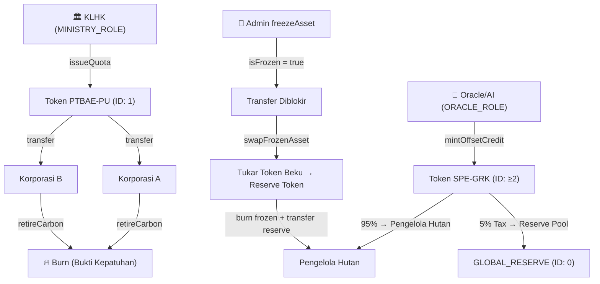
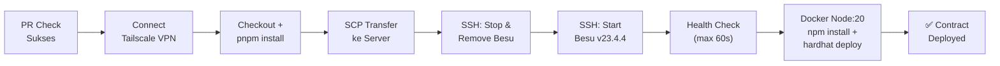
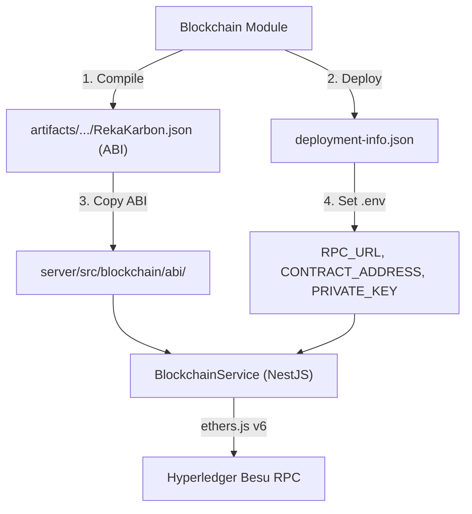
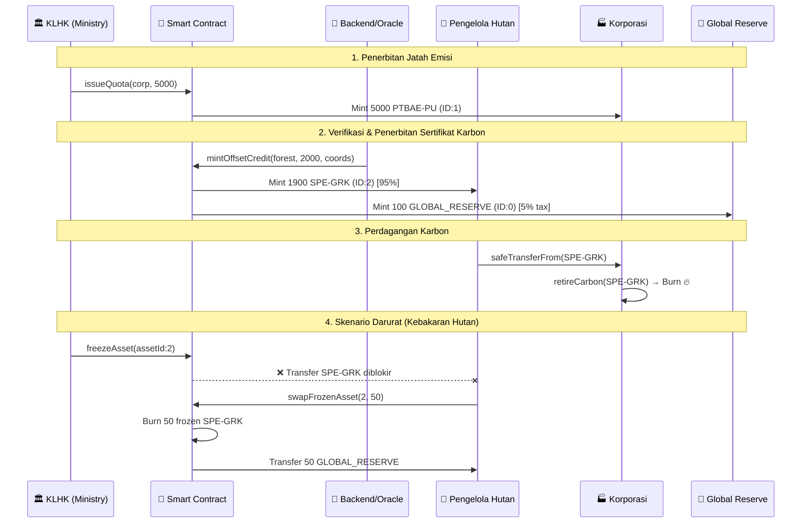

# 🔗 Riset Lengkap: Modul Blockchain RekaKarbon

> [!NOTE]
> Dokumen ini merangkum **seluruh struktur, workflow, dan code** pada folder `blockchain/` agar menjadi referensi saat mulai pengerjaan.

---

## 1. Arsitektur & Technology Stack

| Komponen | Teknologi | Versi/Detail |
|---|---|---|
| Smart Contract | Solidity | `^0.8.24` |
| Library | OpenZeppelin Contracts | **`5.0.0`** (pinned, bukan `^5.x`) |
| Framework | Hardhat + TypeScript | `^2.22.8` |
| EVM Target | **Paris** | Hindari `PUSH0`/`mcopy` (Cancun) |
| Blockchain Node | Hyperledger Besu | `v23.4.4` (Docker) |
| Chain ID | `1337` | Dev network |
| Backend Integration | NestJS + ethers.js v6 | Di folder `server/` |
| Package Manager | pnpm | Monorepo workspace |
| CI/CD | GitHub Actions | 2 workflow files |
| VPN/Tunnel | Tailscale | Koneksi ke server deployment |

> [!IMPORTANT]
> OpenZeppelin **wajib** dipinning di `v5.0.0` dan EVM target **wajib** `paris`. Ini karena Besu `v23.4.4` tidak support opcode Cancun (`PUSH0`, `mcopy`).

---

## 2. Struktur Direktori

```
blockchain/
├── .env                    # Private key (dev, gitignored)
├── .env.example            # Template environment
├── .gitignore
├── AGENTS.md               # Governance guide untuk AI agents
├── DOCUMENTATION.md        # Dokumentasi infra lengkap
├── INTEGRASI_BACKEND.md    # Panduan integrasi ke NestJS
├── docker-compose.yml      # Docker config Besu (lokal)
├── hardhat.config.ts       # Konfigurasi Hardhat
├── package.json            # @rekakarbon/blockchain
├── tsconfig.json           # TypeScript config
├── contracts/
│   └── RekaKarbon.sol      # 🔑 Smart contract utama (ERC-1155)
├── scripts/
│   └── deploy.ts           # Script deployment ke Besu
├── test/
│   └── RekaKarbon.test.ts  # Unit & integration tests (Mocha/Chai)
├── besu-config/
│   └── genesis.json        # Genesis block configuration (Clique PoA)
├── artifacts/              # Hasil kompilasi (auto-generated, gitignored)
│   ├── @openzeppelin/
│   ├── build-info/
│   └── contracts/
│       └── RekaKarbon.sol/
│           └── RekaKarbon.json  # 📦 ABI artifact (di-copy ke server/)
├── cache/                  # Hardhat cache (gitignored)
└── node_modules/           # Dependencies (gitignored)
```

---

## 3. Smart Contract: [`RekaKarbon.sol`](file:///c:/Peyimpanan%20Pribadi/PROJEK%20BESAR/RekaKarbon/blockchain/contracts/RekaKarbon.sol)

### 3.1 Standar & Inheritance

```
RekaKarbon is ERC1155, AccessControl, ERC1155Holder
```

- **ERC-1155**: Multi-asset token standard (satu kontrak = banyak jenis token)
- **AccessControl**: Role-Based Access Control (RBAC)
- **ERC1155Holder**: Agar kontrak sendiri bisa menerima token ERC-1155 (untuk reserve pool)

### 3.2 Token IDs & Jenis Aset

| Token ID | Nama | Keterangan |
|---|---|---|
| `0` | `GLOBAL_RESERVE` | Pool asuransi global (5% tax cut otomatis) |
| `1` | `PTBAE_PU` | Jatah Emisi Nasional (diterbitkan KLHK) |
| `>= 2` | `SPE-GRK` | Sertifikat Pengurangan Emisi GRK (auto-increment) |

### 3.3 Role-Based Access Control (RBAC)

| Role | Kode | Hak Akses |
|---|---|---|
| `DEFAULT_ADMIN_ROLE` | `0x00` (bawaan OZ) | `freezeAsset()`, `unfreezeAsset()`, `grantRole()` |
| `MINISTRY_ROLE` | `keccak256("MINISTRY_ROLE")` | `issueQuota()` — menerbitkan PTBAE-PU |
| `ORACLE_ROLE` | `keccak256("ORACLE_ROLE")` | `mintOffsetCredit()` — mencetak SPE-GRK |

### 3.4 Struct: `CarbonAsset`

```solidity
struct CarbonAsset {
    string assetType;    // "RESERVE-POOL", "PTBAE-PU", "SPE-GRK"
    address creator;     // Alamat pencetak
    string coordinates;  // Titik koordinat proyek ("Lat: -6.2, Long: 106.8")
    bool isFrozen;       // Status pembekuan darurat
}
```

### 3.5 Fungsi-Fungsi Utama



#### Detail Fungsi:

| Fungsi | Modifier | Input | Logika |
|---|---|---|---|
| [`issueQuota()`](file:///c:/Peyimpanan%20Pribadi/PROJEK%20BESAR/RekaKarbon/blockchain/contracts/RekaKarbon.sol#L75-L77) | `MINISTRY_ROLE` | `to`, `amount` | Mint `PTBAE_PU` (ID 1) ke alamat tujuan |
| [`mintOffsetCredit()`](file:///c:/Peyimpanan%20Pribadi/PROJEK%20BESAR/RekaKarbon/blockchain/contracts/RekaKarbon.sol#L84-L109) | `ORACLE_ROLE` | `to`, `amount`, `coordinates` | Mint SPE-GRK baru; 95% ke penerima, 5% ke `GLOBAL_RESERVE` |
| [`swapFrozenAsset()`](file:///c:/Peyimpanan%20Pribadi/PROJEK%20BESAR/RekaKarbon/blockchain/contracts/RekaKarbon.sol#L115-L127) | Public | `frozenAssetId`, `amount` | Burn token beku, transfer RESERVE ke pengguna (klaim asuransi) |
| [`retireCarbon()`](file:///c:/Peyimpanan%20Pribadi/PROJEK%20BESAR/RekaKarbon/blockchain/contracts/RekaKarbon.sol#L132-L138) | Public | `assetId`, `amount` | Burn token sebagai bukti offset/kepatuhan emisi |
| [`freezeAsset()`](file:///c:/Peyimpanan%20Pribadi/PROJEK%20BESAR/RekaKarbon/blockchain/contracts/RekaKarbon.sol#L142-L146) | `DEFAULT_ADMIN_ROLE` | `assetId` | Set `isFrozen = true` (darurat, misal hutan terbakar) |
| [`unfreezeAsset()`](file:///c:/Peyimpanan%20Pribadi/PROJEK%20BESAR/RekaKarbon/blockchain/contracts/RekaKarbon.sol#L150-L154) | `DEFAULT_ADMIN_ROLE` | `assetId` | Set `isFrozen = false` |

### 3.6 Transfer Guard: `_update()` Override

[`_update()`](file:///c:/Peyimpanan%20Pribadi/PROJEK%20BESAR/RekaKarbon/blockchain/contracts/RekaKarbon.sol#L158-L173) adalah internal hook dari ERC-1155 v5. Logikanya:
- **Mint** (`from == address(0)`) → **diizinkan** meski frozen
- **Burn** (`to == address(0)`) → **diizinkan** (untuk `swapFrozenAsset`)
- **Transfer antar alamat** → **diblokir** jika `isFrozen == true`

### 3.7 Events

| Event | Parameter | Kapan Dipancarkan |
|---|---|---|
| `AssetFrozen` | `assetId` | Saat admin membekukan aset |
| `AssetUnfrozen` | `assetId` | Saat admin membuka blokir |
| `CarbonRetired` | `account`, `assetId`, `amount` | Saat token di-burn untuk kepatuhan |
| `InsuranceClaimed` | `account`, `frozenAssetId`, `amount` | Saat klaim asuransi berhasil |

---

## 4. Deployment Script: [`deploy.ts`](file:///c:/Peyimpanan%20Pribadi/PROJEK%20BESAR/RekaKarbon/blockchain/scripts/deploy.ts)

Alur deployment:

1. Ambil signer (deployer) dari Hardhat
2. Tampilkan saldo ETH deployer
3. Deploy kontrak `RekaKarbon`
4. Grant `ORACLE_ROLE` ke alamat deployer (agar backend bisa mint)
5. Simpan `deployment-info.json` berisi contract address, network, deployer, dan timestamp

---

## 5. Test Suite: [`RekaKarbon.test.ts`](file:///c:/Peyimpanan%20Pribadi/PROJEK%20BESAR/RekaKarbon/blockchain/test/RekaKarbon.test.ts)

Test menggunakan **Mocha + Chai** dengan 5 signers: `admin`, `ministry`, `oracle`, `corpA`, `corpB`.

| # | Test Group | Skenario |
|---|---|---|
| 1 | Issue Quota (KLHK) | ✅ Ministry bisa mint PTBAE-PU; ❌ Non-authorized gagal |
| 2 | Mint Offset + Auto Tax | ✅ Oracle mint 2000 SPE-GRK → 1900 ke penerima, 100 ke reserve |
| 3 | Transfer & Freeze | ✅ Transfer normal; ✅ Admin freeze; ❌ Transfer saat frozen; ✅ Admin unfreeze |
| 4 | Retire Carbon | ✅ Burn token, saldo berkurang |
| 5 | Insurance Swap | ❌ Klaim tanpa freeze ditolak; ✅ Swap frozen → reserve berhasil |

---

## 6. Infrastruktur: Hyperledger Besu

### 6.1 Docker Compose (Lokal): [`docker-compose.yml`](file:///c:/Peyimpanan%20Pribadi/PROJEK%20BESAR/RekaKarbon/blockchain/docker-compose.yml)

- Image: `hyperledger/besu:latest` (lokal dev)
- Mode: `--network=dev` (built-in dev accounts)
- Ports: `8545` (HTTP RPC), `8546` (WebSocket)
- Mining: enabled, coinbase `0x627306...`
- Volume: `besu_data` persistent

### 6.2 Genesis Block: [`genesis.json`](file:///c:/Peyimpanan%20Pribadi/PROJEK%20BESAR/RekaKarbon/blockchain/besu-config/genesis.json)

- **Consensus**: Clique (Proof of Authority)
- **Block period**: 1 detik
- **Chain ID**: 1337
- **Pre-funded accounts**:
  - `0xfe3b557e...` — ~100,000 ETH (sealer/validator)
  - `0x62730609...` — ~100,000,000 ETH (coinbase/miner)

### 6.3 Hardhat Config: [`hardhat.config.ts`](file:///c:/Peyimpanan%20Pribadi/PROJEK%20BESAR/RekaKarbon/blockchain/hardhat.config.ts)

```typescript
{
  solidity: { version: "0.8.24", evmVersion: "paris" },
  networks: {
    besu_local: { url: "http://127.0.0.1:8545", chainId: 1337 }
  }
}
```

---

## 7. CI/CD Pipeline

### 7.1 PR Check: [`pr-check.yml`](file:///c:/Peyimpanan%20Pribadi/PROJEK%20BESAR/RekaKarbon/.github/workflows/pr-check.yml)

Dijalankan saat PR, hanya jika ada perubahan di `blockchain/**`:
1. `pnpm blockchain:typecheck`
2. `pnpm blockchain:compile`
3. `pnpm blockchain:test`

### 7.2 Deploy: [`deploy-blockchain.yml`](file:///c:/Peyimpanan%20Pribadi/PROJEK%20BESAR/RekaKarbon/.github/workflows/deploy-blockchain.yml)

Trigger: Setelah PR Check **sukses** di branch `main`, atau manual `workflow_dispatch`.



**Server path**: `~/VM_BLOCKHAIN/blockchain`

**GitHub Secrets yang digunakan**:
- `BLOCKCHAIN_TS_AUTHKEY` — Tailscale auth key
- `BLOCKCHAIN_SSH_HOST`, `BLOCKCHAIN_SSH_USERNAME`, `BLOCKCHAIN_SSH_PASSWORD`
- `BLOCKCHAIN_PRIVATE_KEY` — Private key untuk deploy

---

## 8. Integrasi Backend (NestJS)

### Alur Integrasi:



### Aturan Penting:
- **`gasPrice: 0`** wajib untuk semua transaksi write di dev network
- **`bigint` / `ethers.BigNumberish`** wajib untuk high-precision values
- Backend memegang `ORACLE_ROLE` sehingga bisa `mintOffsetCredit()`
- Transaction hash wajib disimpan ke PostgreSQL sebagai secondary indexing

---

## 9. Workflow Bisnis End-to-End



---

## 10. Perintah Development

```bash
# Kompilasi smart contract
pnpm --filter @rekakarbon/blockchain run compile

# Jalankan semua test
pnpm --filter @rekakarbon/blockchain test

# TypeScript typecheck
pnpm --filter @rekakarbon/blockchain run typecheck

# Deploy ke Besu lokal
pnpm --filter @rekakarbon/blockchain exec hardhat run scripts/deploy.ts --network besu_local

# Start Besu lokal (Docker)
cd blockchain && docker-compose up -d
```
