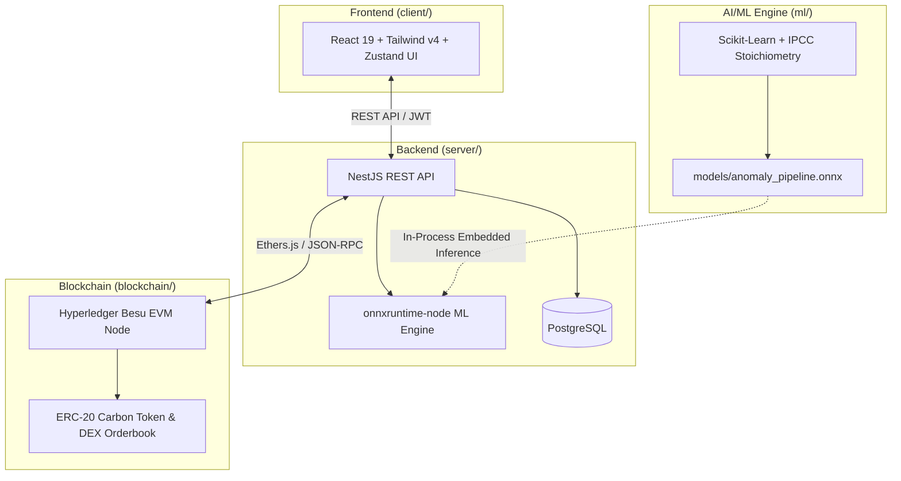

# 🌿 RekaKarbon - Digital MRV & Carbon Exchange Platform (Bursa Karbon)

> Enterprise-grade Digital Measurement, Reporting, and Verification (dMRV) with AI Anomaly Detection and Blockchain Tokenization for the Indonesian Carbon Market.

---

## 🏛️ Monorepo Architecture

RekaKarbon is structured as a high-performance monorepo integrating modern web, AI/ML, and Web3 technologies:

```
RekaKarbon/
├── client/          # 🎨 Frontend Web Application (React 19, Tailwind CSS v4, Zustand, Vite)
├── server/          # ⚙️ Enterprise Backend API (NestJS, Prisma, PostgreSQL, onnxruntime-node)
├── blockchain/      # ⛓️ Smart Contracts & EVM Network (Solidity, Hardhat, Hyperledger Besu)
├── ml/              # 🌿 AI/ML Anomaly Detection Engine (Scikit-Learn, ONNX, Streamlit, Pytest)
├── assets/data/     # 📊 Official Indonesian Benchmark Datasets (BPS, KLHK, ESDM)
└── .agents/skills/  # 🤖 Shared AI Agent Specifications and Standards
```



---

## 🚀 Key Subprojects

### 1. 🎨 Client (`client/`)

- Modern, accessible user interface adhering to the **"Ecological Precision"** design system tokens.
- Interactive Carbon DEX trading terminal, spatial drone GIS map viewer, and emitter reporting wizards.
- Tech: React 19, Tailwind CSS v4, Lucide React, Zustand, Recharts, Vite.

### 2. ⚙️ Server (`server/`)

- Production-grade modular backend managing authorization, emitter filings, multi-tier audits, and marketplace orderbooks.
- **Embedded AI/ML Engine**: In-process execution of `anomaly_pipeline.onnx` using `onnxruntime-node` for real-time filing verification.
- Tech: NestJS 11, Prisma 7, PostgreSQL, Ethers.js v6, `onnxruntime-node`.

### 3. 🌿 AI/ML Engine (`ml/`)

- Industrial emission anomaly detection adhering to the **GHG Protocol Corporate Standard** (Scope 1 direct combustion & IPPU, Scope 2 purchased electricity, and fully optional Scope 3 value chain).
- 20-dimensional physical stoichiometric modeling, DJP e-Faktur price boundary checks, dynamic sector configuration via `sectors.json`, and unsupervised multivariate Isolation Forest isolation.
- Built as a **Verificator Decision Support** copilot providing risk priority tiers (`critical`, `high`, `medium`, `low`), multi-tier trust scores, scope-by-scope diagnostics, and XAI recommendations.
- Fully validated across **9 MLOps testing layers** (37 / 37 tests passing, $100\%$ numerical ONNX parity, $F_1 = 1.0000$, $\text{ROC-AUC} = 0.9845$, $0.0\%$ False Positive Rate).
- Tech: Python 3.13, Scikit-Learn, `skl2onnx`, ONNX Runtime, Pydantic, Streamlit Studio, Pytest.

### 4. ⛓️ Blockchain & Smart Contracts (`blockchain/`)

- Private EVM blockchain infrastructure for transparent carbon credit minting, multi-signature verification, and decentralized token trading.
- Tech: Solidity 0.8.28, Hardhat, Hyperledger Besu, OpenZeppelin.

---

## 🛠️ Monorepo Commands & Development

### 1. Installation

```bash
pnpm install
```

### 2. Running Development Environments

```bash
# Frontend development server (http://localhost:5173)
pnpm client:dev

# Backend development server (http://localhost:3000)
pnpm server:dev

# ML Interactive Prototyping Studio (http://localhost:8501)
pnpm ml:dev
```

### 3. Monorepo Quality Verification (PR Checks)

```bash
# Code Formatting (Prettier & Ruff)
pnpm format:check
pnpm format:write

# Static Type Checking
pnpm typecheck
# Or individually:
pnpm client:typecheck
pnpm server:typecheck
pnpm ml:typecheck

# Linters
pnpm client:lint
pnpm server:lint
pnpm ml:lint

# Test Suites
pnpm client:test
pnpm server:test
pnpm ml:test
pnpm blockchain:test
```

---

## 📖 Key Documentation

- **Monorepo Agent Governance**: [`AGENTS.md`](AGENTS.md)
- **AI/ML Engine Scientific Guide**: [`ml/README.md`](ml/README.md)
- **Backend API & Architecture**: [`server/README.md`](server/README.md)
- **Blockchain Smart Contracts Guide**: [`blockchain/DOCUMENTATION.md`](blockchain/DOCUMENTATION.md)
- **Frontend Design System**: [`client/DESIGN.md`](client/DESIGN.md)
