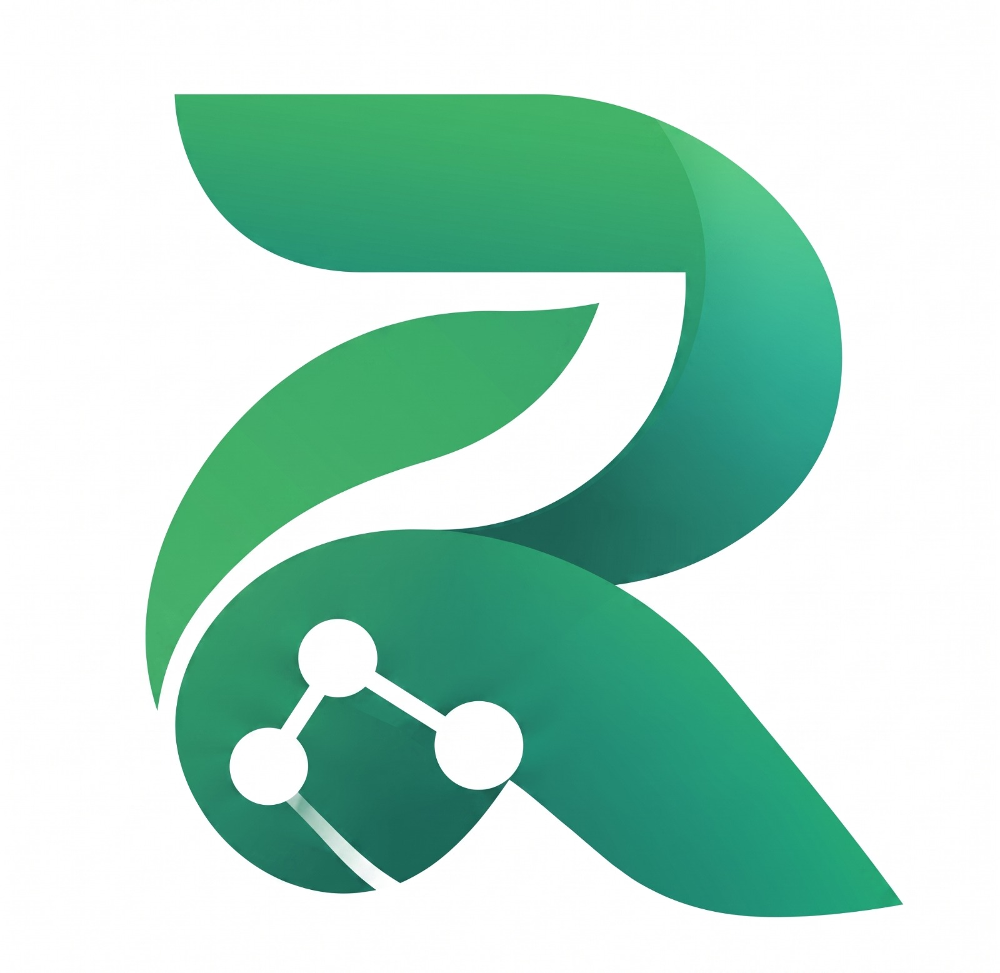
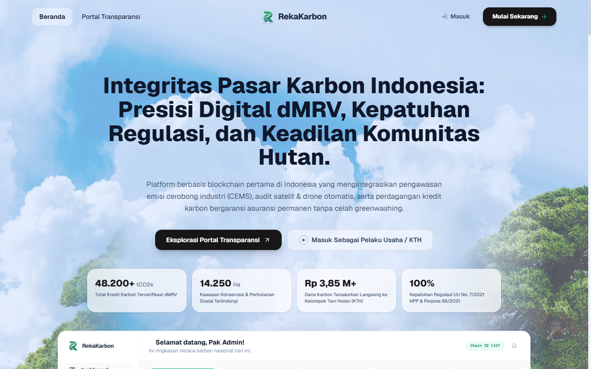
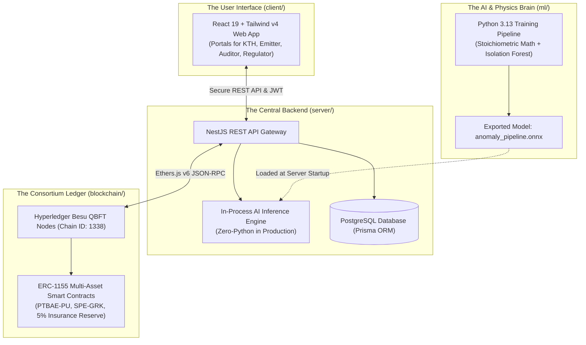

<p align="center">
  
</p>

# RekaKarbon - Digital MRV & Carbon Exchange Ecosystem

> **Empowering Indonesia's Climate Action through Intelligent Digital MRV (dMRV), Consortium Blockchain, and Fair Carbon Exchange.**
>
> RekaKarbon transforms how industrial emissions are reported, how community forestry projects are audited, and how carbon credits are issued and traded—replacing months of paper-heavy bureaucracy with transparent, near real-time, tamper-proof digital governance.

<p align="center">
  <a href="https://rekakarbon.farrelad.com" target="_blank" rel="noopener noreferrer">
    
  </a>
  <br />
  <em>Visit us: <a href="https://rekakarbon.farrelad.com"><strong>rekakarbon.farrelad.com</strong></a></em>
</p>

---

## 🌍 The Problem: Why Carbon Markets Need Transformation

Indonesia is at a decisive turning point in climate governance. With rising global temperatures and domestic atmospheric $\text{CO}_2$ concentration climbing continuously (recorded from $372\text{ ppm}$ in 2004 to $423.5\text{ ppm}$ at the Bukit Kototabang Global Atmosphere Watch station), Indonesia has set an ambitious target in its Enhanced Nationally Determined Contribution (NDC): **reducing greenhouse gas emissions by 31.89% independently (or 43.20% with international support) by 2030, on the road to Net-Zero Emissions by 2060**.

However, turning climate ambitions into real-world action encounters severe operational friction:



### 1. The "Self-Reporting" Dilemma & Greenwashing

For heavy manufacturing (cement, steel, chemicals, pulp & paper), replacing entire thermal boilers and power infrastructure overnight demands immense capital expenditure. The **Economic Carbon Value (Nilai Ekonomi Karbon - NEK)** and carbon trading mechanisms exist precisely to provide a flexible transition. Yet, conventional emission filing is dominated by manual, self-reported paperwork. Without automated cross-checks, companies can under-report Scope 1 direct emissions or declare fictitious numbers, leading to **greenwashing** and eroding trust.

### 2. Tropical Cloud Cover & High Audit Costs

On the supply side, community forest restoration groups (Kelompok Tani Hutan - KTH) generate vital carbon sequestration. But traditional forestry Measurement, Reporting, and Verification (MRV) relies on manual, boots-on-the-ground surveys that take months and incur high consulting fees. Meanwhile, pure satellite optical sensing is often blinded by Indonesia's dense, perennial tropical cloud cover. As highlighted in field discussions with Balai Taman Nasional Baluran, the true test of forest survival is continuous tracking during the critical first 0–4 years of tree growth—something sporadic manual surveys cannot reliably deliver.

### 3. The Double-Counting Threat & Registry Silos

Because the national registry (SRN PPI), carbon exchange (IDX Carbon), and international markets have historically operated on isolated databases, there is an ever-present risk of **double counting**—where the same verified ton of carbon reduction is claimed by two different entities. This lack of tamper-proof synchronization discourages foreign investors and weakens market confidence.

### 4. Bureaucratic Delays & Low Market Liquidity

Verifying an emission reduction certificate can take anywhere from six months to over a year. By the time certificates are minted, market momentum is lost. Local community forest stewards receive delayed, unpredictable compensation, while industrial buyers face compliance deadlines without readily available, trusted domestic carbon credits.

---

## 💡 The Solution: RekaKarbon Ecosystem

**RekaKarbon** is an integrated e-Government Digital MRV and Carbon Exchange platform. Rather than attempting to replace existing state institutions, RekaKarbon acts as a **smart system integrator**—connecting continuous emission monitoring, fiscal tax registries, drone aerial surveys, satellite telemetry, and decentralized ledgers into one cohesive workflow.

```mermaid
flowchart LR
    subgraph Supply ["1. Forest Supply (KTH)"]
        Drone["Drone Orthophotos\n(Canopy Height & Survival)"]
        Sat["Satellite Telemetry\n(NDVI / EVI via NusaCarbon)"]
    end

    subgraph Verification ["2. AI-Powered dMRV"]
        Stoich["Physics & Stoichiometry\n(Fuel & Grid Divergence)"]
        DJP["Fiscal Invoices\n(DJP e-Faktur Pricing)"]
        ML["Isolation Forest AI\n(Multivariate Anomaly Score)"]
    end

    subgraph Trust ["3. Consortium Blockchain"]
        Besu["Hyperledger Besu QBFT\n(Zero Double Counting)"]
        Tokens["Tokens: PTBAE-PU, SPE-GRK,\n& 5% Wildfire Reserve"]
    end

    subgraph Market ["4. Bursa Karbon DEX"]
        DEX["Near Real-Time Trading\n& Retirement Certificates"]
        Impact["Fair Cost Floor Price\n(Direct Funds to Farmers)"]
    end

    Supply -->|"Hybrid Field Data"| Verification
    Verification -->|"Auditor Human-in-the-Loop"| Trust
    Trust -->|"Mint Verified Credits"| Market
```



### 🌿 1. Intelligent Automated dMRV (AI/ML Engine)

- **Stoichiometric & Energy Combustion Checks**: Validates reported emissions against the physical laws of thermodynamics (e.g., fuel consumption vs. Scope 1 direct emissions; PLN electricity expenditures vs. Scope 2 grid factors).
- **Fiscal Tax Cross-Validation (DJP e-Faktur)**: Cross-references industrial utility and fuel purchase receipts against reported tonnage to detect fabricated filings.
- **Multivariate Isolation Forest**: Analyzes 20 physical and fiscal dimensions to produce a real-time risk score and Explainable AI (XAI) diagnostics, empowering human auditors (**Human-in-the-Loop**) to fast-track honest filings and flag suspicious anomalies.

### 🌲 2. Hybrid Drone & Satellite Verification for Tropical Forests

- Overcomes the tropical cloud barrier by pairing **satellite vegetation indices** (NDVI/EVI via NusaCarbon API) with **local Forestry Department drone orthophoto surveys**.
- Tracks tree survival and canopy growth (Canopy Height Model $\ge 1.5\text{ m}$) across the vulnerable 0–4 year growth cycle.
- Calculates an objective **cost-based floor price** per ton of $\text{CO}_2\text{e}$ to ensure local community forest stewards receive fair, living-wage compensation for their ecological labor.

### ⛓️ 3. Tamper-Proof Consortium Blockchain (Hyperledger Besu QBFT)

- Employs an enterprise **Hyperledger Besu** network with **QBFT (Quorum Byzantine Fault Tolerance)** consensus across institutional validator nodes.
- **ERC-1155 Multi-Asset Tokenization**:
  - `PTBAE-PU` (Compliance Allowance Tokens allocated to industrial emitters).
  - `SPE-GRK` (Certified Emission Reduction Tokens generated by verified forestry and green projects).
  - `GLOBAL_RESERVE` (An automatic 5% insurance buffer pool retained on every mint to cover accidental forest loss or seasonal wildfire damage).
- **Absolute Immutability**: Every issuance, transfer, and retirement is permanently sealed on-chain, eliminating the double-counting risk forever.

### 📈 4. Transparent Bursa Karbon DEX & Social Impact

- Slashes transaction settlement and clearing from months to seconds.
- Automatically channels **62% of credit purchase funds directly to ground restoration and planting operations**, creating sustainable economic livelihoods for forest communities.
- Generates cryptographically verifiable **Carbon Retirement Certificates** for corporate environmental compliance.

---

## 👥 How It Works: Stakeholder Portals

| Role / Stakeholder                  | What They Do on RekaKarbon                                                                                                                    | Primary Benefit                                                                                              |
| :---------------------------------- | :-------------------------------------------------------------------------------------------------------------------------------------------- | :----------------------------------------------------------------------------------------------------------- |
| 🌲 **Community Forestry (KTH)**     | Upload drone flight telemetry, map forest polygon boundaries, track biomass growth, and withdraw revenue into digital wallets.                | Fair pricing, transparent direct funding, and automated certification without predatory middlemen.           |
| 🏭 **Industrial Emitters**          | Submit Scope 1, 2, and 3 emission reports via an intuitive wizard, track carbon tax liabilities, and purchase offset credits on Bursa Karbon. | Seamless regulatory compliance, automated tax estimation, and rapid access to verified local carbon credits. |
| 🔍 **Auditors & Verificators**      | Inspect drone orthophoto GIS overlays, review AI anomaly detection flags, and authorize token minting with Human-in-the-Loop oversight.       | High-speed automated verification, objective XAI evidence cards, and reduced physical audit expenses.        |
| 🏛️ **Regulators (KLHK & Kemenkeu)** | Monitor national industrial emission balances, allocate annual PTBAE-PU quotas, inspect the national registry, and verify tax compliance.     | Real-time national emission visibility, tamper-proof audit trails, and data-driven climate policymaking.     |

---

## 🛠️ Turning Ideas into Reality: How We Engineered RekaKarbon

The solution described above is not just a theoretical concept—it is fully implemented and running inside this repository.

To bring an ecosystem combining climate science, artificial intelligence, and blockchain to life without confusion, we organized this repository as a **unified digital workspace** (often called a _monorepo_ in software engineering). Think of it as a single workshop where different specialist teams build distinct parts of the machine, all designed to fit together seamlessly:

- 🌿 **The Brain (`ml/`)**: Where our AI research and climate science happen. This workspace houses the stoichiometric formulas, thermodynamics calculations, and the machine learning model (_Isolation Forest_) that detects fraudulent or anomalous emission filings.
- ⛓️ **The Trust Engine (`blockchain/`)**: Where our immutable rules live. This workspace contains the Solidity smart contracts and our private Hyperledger Besu consortium network that tokenizes carbon credits (`PTBAE-PU` and `SPE-GRK`) and permanently prevents double counting.
- ⚙️ **The Central Core (`server/`)**: The enterprise backend engine (built with NestJS). It connects to PostgreSQL, loads our trained AI model directly into memory for instant real-time verification, and handles transactions with the blockchain.
- 🎨 **The Experience (`client/`)**: The interactive web application (built with React 19 and Tailwind CSS v4). It delivers the tailored screens and workflows for our four key stakeholders: forest farmers, factory managers, independent auditors, and ministry regulators.

By keeping these specialized modules in one collaborative workspace, our team ensures that every change—whether updating a smart contract, calibrating an emission feature, or designing a new dashboard screen—remains completely synchronized and verified through automated checks.

### 🏛️ Repository Organization & Data Flow

Here is how the project folders are arranged and how information flows between them:

```
RekaKarbon/
├── client/          # 🎨 Frontend Web App: User interfaces for farmers, industry, auditors & regulators
├── server/          # ⚙️ Backend API: Coordinates business logic, database, AI inference & blockchain
├── blockchain/      # ⛓️ Smart Contracts & Network: Consortium ledger for tamper-proof carbon tokenization
├── ml/              # 🌿 AI/ML Engine: Scientific GHG Protocol validation & anomaly detection pipelines
├── assets/data/     # 📊 Official Benchmark Data: BPS, KLHK, ESDM reference statistics & sector priors
└── .agents/skills/  # 🤖 Shared Standards: Specifications and automated coding guidelines
```



---

## 📦 Sub-Projects & Technical Documentation

Every sub-project maintains dedicated documentation: a **`README.md`** tailored for human engineers and contributors, and an **`AGENTS.md`** containing strict architectural rules and quality gates for AI coding agents:

| Sub-Project             | Human Overview & Guide                       | AI Agent Rules & Architecture                | Technology Stack                                                      |
| :---------------------- | :------------------------------------------- | :------------------------------------------- | :-------------------------------------------------------------------- |
| **🎨 Client**           | [client/README.md](client/README.md)         | [client/AGENTS.md](client/AGENTS.md)         | React 19, React Router v7, Tailwind CSS v4, Zustand, Lucide, Recharts |
| **⚙️ Server**           | [server/README.md](server/README.md)         | [server/AGENTS.md](server/AGENTS.md)         | NestJS 11, Prisma 7, PostgreSQL, `onnxruntime-node`, Ethers.js v6     |
| **⛓️ Blockchain**       | [blockchain/README.md](blockchain/README.md) | [blockchain/AGENTS.md](blockchain/AGENTS.md) | Solidity 0.8.24, OpenZeppelin v5.0.0, Hardhat, Hyperledger Besu QBFT  |
| **🌿 Machine Learning** | [ml/README.md](ml/README.md)                 | [ml/AGENTS.md](ml/AGENTS.md)                 | Python 3.13, Scikit-Learn, ONNX Runtime, Pydantic, Streamlit          |

---

## 🚀 Quick Start Guide

### Prerequisites

- **Node.js**: `24.15.0`
- **Package Manager**: `pnpm 11.22.0`
- **Python**: `3.13+` with [Poetry](https://python-poetry.org/) (for ML training)
- **Docker & Docker Compose**: v2.20+ (for PostgreSQL and the local Besu QBFT cluster)

### 1. Installation

Install all monorepo dependencies across `client`, `server`, and `blockchain`:

```bash
pnpm install
```

### 2. Running Local Development

Run the frontend client and backend server concurrently:

```bash
# Starts both NestJS backend (http://localhost:3000) and React frontend (http://localhost:5173)
pnpm dev
```

Or run individual subprojects independently:

```bash
# Run Frontend Client only
pnpm client:dev

# Run Backend Server only
pnpm server:dev

# Run ML Interactive Studio (http://localhost:8501)
pnpm ml:studio
```

### 3. Running Automated Tests & Quality Checks

Ensure complete system integrity across all layers:

```bash
# 1. Format check (Prettier)
pnpm format:check

# 2. Typecheck across all TypeScript and Python packages
pnpm typecheck

# 3. Client & Server Contract Tests
pnpm test:contracts

# 4. Subproject Unit Tests
pnpm client:test       # React unit & architecture tests
pnpm server:test       # NestJS controller & service tests
pnpm blockchain:test   # Hardhat smart contract tests
pnpm ml:test           # Pytest suite & ONNX mathematical parity checks
```

---

## 👥 The Minds Behind RekaKarbon

RekaKarbon was conceptualized and developed under academic mentorship at **Politeknik Negeri Malang** for the **KMIPN 2026** National Competition:

### 🎓 Project Initiator & Academic Advisor

- **Agung Nugroho Pramudhita, S.T., M.T.**
  - _Lecturer & Academic Mentor_, Politeknik Negeri Malang
  - Project Initiator and Academic Advisor who guided the overarching vision, research methodology, and system foundations.

### 💻 Student Engineering & Research Team

Engineered and implemented collaboratively by his students:

- **Petrus Tyang Agung Rosario** — _Student Researcher & Developer_
- **Ekya Muhammad Hasfi Fadlilurrahman** — _Student Researcher & Developer_
- **Farrel Augusta Dinata** — _Student Researcher & Developer_

---

## 🔬 Project Status & Ongoing Evolution

> **Active Research & Pilot Prototype (KMIPN 2026)**

RekaKarbon was initiated as an ambitious pilot prototype for the **KMIPN 2026** National Competition. Developing a national-scale digital MRV ecosystem and sovereign carbon exchange is an intricate, multidisciplinary challenge—demanding continuous exploration at the intersection of climate economics, physical thermodynamics, machine learning calibration, and consortium blockchain engineering.

While this repository demonstrates a fully functional, end-to-end working system, our research and engineering efforts are actively ongoing:

- **Continuous Scientific Calibration**: Refining thermodynamic combustion priors and sector-specific carbon intensity baselines across more industrial domains.
- **Enhanced Spatial Telemetry**: Exploring automated drone orthophoto pipelines, canopy height estimation, and cloud-resilient vegetation index modeling.
- **Scalable Consensus Engineering**: Iterating on consortium throughput, validator fault tolerance, and institutional governance models.

We treat this project not as a static submission, but as a living research initiative aimed at genuinely advancing Indonesia's digital climate infrastructure.

---

## ⚖️ Open Source License & Mandatory Attribution

This project is licensed under the open-source **[Apache License 2.0](LICENSE)**.

### 📌 Mandatory Attribution Requirement

Under the terms of the Apache 2.0 License and the accompanying **[NOTICE](NOTICE)** file, **anyone using, modifying, adapting, or building a similar/derivative solution based on RekaKarbon must provide prominent attribution and acknowledgment** to the RekaKarbon project, its academic initiator, and its student developers.

If you reference, adapt, or build upon this project in academic research, competition entries, or software development, please include the following citation:

#### BibTeX Citation:

```bibtex
@software{rekakarbon2026,
  author = {Pramudhita, Agung Nugroho and Rosario, Petrus Tyang Agung and Fadlilurrahman, Ekya Muhammad Hasfi and Dinata, Farrel Augusta},
  title = {RekaKarbon: Digital MRV & Carbon Exchange Ecosystem with AI Anomaly Detection and Consortium Blockchain},
  year = {2026},
  url = {https://rekakarbon.farrelad.com},
  note = {Politeknik Negeri Malang (KMIPN 2026). Available at: https://github.com/KMIPN-2026/RekaKarbon}
}
```

#### APA Citation:

> Pramudhita, A. N., Rosario, P. T. A., Fadlilurrahman, E. M. H., & Dinata, F. A. (2026). _RekaKarbon: Digital MRV & Carbon Exchange Ecosystem with AI Anomaly Detection and Consortium Blockchain_ [Computer software]. Politeknik Negeri Malang. https://rekakarbon.farrelad.com

For machine-readable citation metadata, see **[`CITATION.cff`](CITATION.cff)**.
