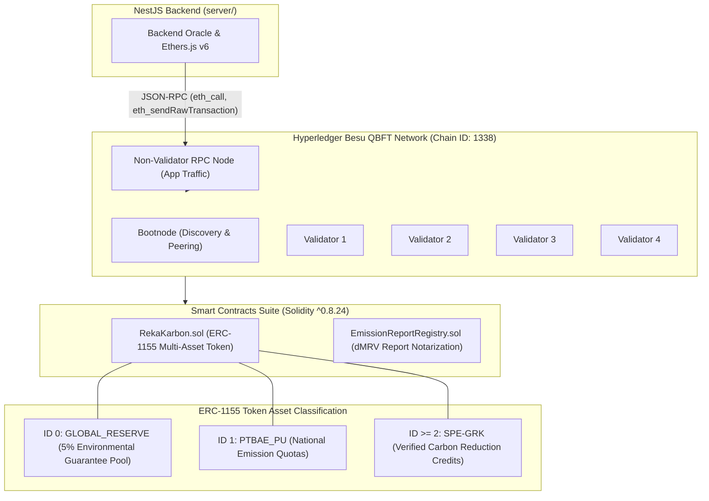

# ⛓️ RekaKarbon Blockchain & Smart Contracts (`blockchain/`)

Enterprise-grade private blockchain infrastructure and smart contract suite powering the **RekaKarbon** Digital Measurement, Reporting, and Verification (dMRV) ecosystem and National Carbon Registry. Built on **Hyperledger Besu** with **QBFT** consensus and **Solidity 0.8.24** on Hardhat.

---

## 🏛️ System Architecture

The RekaKarbon blockchain module provides an immutable, auditable, and sovereign ledger for national carbon quotas and certificates in compliance with Indonesian environmental regulations.



---

## 📜 Smart Contracts Suite

### 1. `RekaKarbon.sol` (Multi-Asset Carbon Standard)

Inherits OpenZeppelin `ERC1155`, `AccessControl`, and `ERC1155Holder`:

- **Multi-Asset Allocation**:
  - **`GLOBAL_RESERVE` (ID `0`)**: National carbon insurance guarantee fund. Automatically deducts and retains a 5% tax levy whenever new `SPE-GRK` offset credits are minted.
  - **`PTBAE_PU` (ID `1`)**: Indonesian National Emission Quota allocated to industrial emitters under ministry cap-and-trade mandates.
  - **`SPE-GRK` (ID `>= 2`)**: Verified GHG Emission Reduction Certificates issued to verified forestry (KTH) and decarbonization projects.
- **Role-Based Access Control (RBAC)**:
  - `DEFAULT_ADMIN_ROLE`: Authorized to pause token classes and emergency freeze assets.
  - `MINISTRY_ROLE`: Authorized to issue and reallocate national carbon allowances (`PTBAE_PU`).
  - `ORACLE_ROLE`: Authorized to mint certified emission reduction credits (`SPE-GRK`) following dMRV audit approval.
- **Emergency Circuit Breaker**:
  - Non-transferability during freeze (`isFrozen == true`).
  - Allows burning of frozen assets exclusively for insurance redemption claims (`swapFrozenAsset`).

### 2. `EmissionReportRegistry.sol`

- Provides on-chain timestamped notarization of industrial GHG emission filings.
- Stores cryptographic hashes (SHA-256) of verified scope emissions, audit payloads, and supporting documentation.

---

## 🌐 Private Network Architecture (Hyperledger Besu QBFT)

The active blockchain environment uses **Hyperledger Besu** configured with **QBFT (Quorum Byzantine Fault Tolerance)** consensus:

| Parameter                     | Specification                                                                 |
| :---------------------------- | :---------------------------------------------------------------------------- |
| **Consensus Mechanism**       | QBFT (4 Validators, fault tolerance: $f = 1$)                                 |
| **Chain ID**                  | `1338` (Local / Testnet)                                                      |
| **Block Time**                | 2 seconds deterministic finality                                              |
| **Target EVM Version**        | `paris` (pinned for stability and opcode compatibility)                       |
| **Gas & Fee Model**           | Nominal non-zero gas price (no hardcoded zero-gas assumptions)                |
| **RPC Endpoint Architecture** | Dedicated non-validator node for client API traffic (`http://127.0.0.1:8545`) |

---

## 🚀 Getting Started

### Prerequisites

- **Node.js**: `24.15.0`
- **Package Manager**: `pnpm 11.22.0`
- **Docker & Docker Compose**: v2.20+ (for running the local multi-node Besu QBFT cluster)

### 1. Installation

From the workspace root or inside `blockchain/`:

```bash
# From workspace root
pnpm install

# Or specifically for blockchain package
pnpm --filter @rekakarbon/blockchain install
```

### 2. Compile Smart Contracts

Compiles Solidity contracts targeting EVM `paris` and generates TypeScript bindings and ABI artifacts in `artifacts/`:

```bash
pnpm --filter @rekakarbon/blockchain compile
# or from within blockchain/
pnpm compile
```

### 3. Run Automated Tests

Executes Hardhat unit tests against the in-memory test network (Chain ID `31337`):

```bash
pnpm --filter @rekakarbon/blockchain test
# or from within blockchain/
pnpm test
```

### 4. TypeScript Typecheck

```bash
pnpm --filter @rekakarbon/blockchain run typecheck
# or from within blockchain/
pnpm typecheck
```

---

## 🐳 Running Local Hyperledger Besu QBFT Cluster

A production-grade 4-validator + bootnode + RPC node cluster can be managed with docker compose:

```bash
# 1. Generate QBFT network genesis, keys, and environment files
pnpm run network:generate

# 2. Start the multi-node Besu QBFT cluster
pnpm run network:up

# 3. Check network health, peer discovery, and block production
pnpm run network:check

# 4. View live logs from the validator and RPC containers
pnpm run network:logs

# 5. Execute preflight validation against the active RPC endpoint
pnpm run qbft:preflight

# 6. Stop the local QBFT cluster
pnpm run network:down
```

---

## 🔗 Backend (NestJS) Handover & Integration

When deploying or modifying contracts for backend consumption:

1. **Extract ABI Artifact**: Copy `artifacts/contracts/RekaKarbon.sol/RekaKarbon.json` into the NestJS backend workspace (`server/src/blockchain/abi/`).
2. **Environment Variables**: Configure in `server/.env`:
   ```env
   RPC_URL="http://127.0.0.1:8545"
   CARBON_TOKEN_ADDRESS="0x..."
   PRIVATE_KEY="0x..."
   BESU_CHAIN_ID=1338
   ```
3. **BigInt Handling**: All token balance queries and transfers MUST use native `bigint` or `ethers.BigNumberish` to avoid numeric truncation.

---

## 📁 Package Directory Structure

```
blockchain/
├── contracts/               # Solidity smart contract source files
│   ├── RekaKarbon.sol       # ERC-1155 token with reserve fee & RBAC
│   └── EmissionReportRegistry.sol # On-chain dMRV audit notarization
├── test/                    # Mocha/Chai Hardhat test suites
│   ├── RekaKarbon.test.ts   # Token lifecycle, minting, freeze tests
│   └── EmissionReportRegistry.test.ts # Report submission tests
├── scripts/                 # Deployment, verification, and utility scripts
│   ├── network/             # QBFT cluster generator, check, and reset scripts
│   ├── deploy.ts            # Contract deployment script
│   ├── preflight-qbft.ts    # RPC connectivity and block preflight check
│   └── fund-wallet-credit.ts # Test account funding script
├── besu-config/             # Besu genesis templates and configuration
├── networks/                # Network topology configs (local-qbft, legacy archive)
├── docker-compose.qbft.yml  # Docker Compose definition for 4-node QBFT cluster
├── hardhat.config.ts        # Hardhat configuration (Solidity 0.8.24, EVM paris)
├── package.json             # Blockchain package manifest and scripts
├── AGENTS.md                # AI agent governance rules and coding standards
└── README.md                # Human-facing technical overview (this file)
```

---

## 🤖 AI Agent Governance

For AI agents modifying smart contracts or network topology:

- Read and follow [AGENTS.md](./AGENTS.md) for strict rules regarding EVM version pinning, OpenZeppelin version locks (`5.0.0`), QBFT fee policies, and ABI synchronization.
