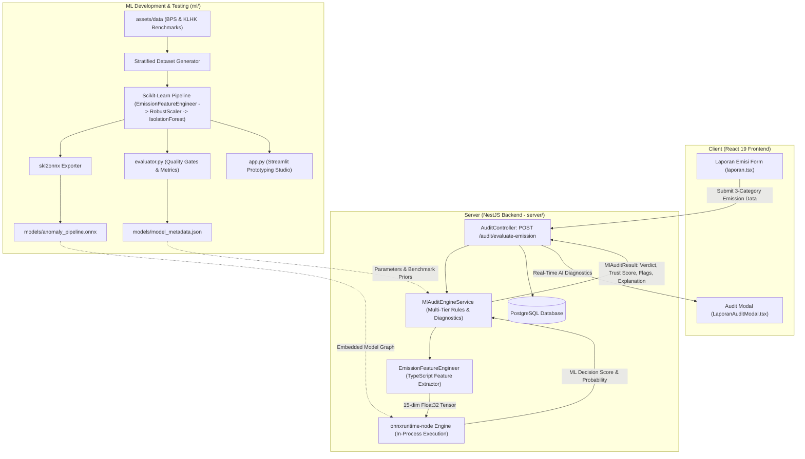

# 🌿 RekaKarbon AI/ML - Carbon Emission Anomaly Detection Engine (dMRV)

Automated AI/ML verification, multi-variable physics stoichiometry, and anomaly detection system for industrial carbon emission reporting in the **RekaKarbon** digital Measurement, Reporting, and Verification (dMRV) ecosystem.

---

## 📌 Executive Summary & Problem Context

In carbon credit markets and national carbon tax registries, data integrity and trust are paramount. Before emissions data can be certified, minted as on-chain carbon tokens, or listed on the **RekaKarbon Carbon DEX (Bursa Karbon)**, filings must undergo rigorous automated cross-verification.

Companies submit periodic GHG reports across 3 mandatory pillars:

1. **Activity-Based Physical Fuel & Biomass Consumption** (Stationary boilers, mobile fleets, biomass residues, process calcination).
2. **Aggregated Energy Utility Financial Costs & DJP e-Faktur** (Solar, coal, gas, PLN electricity spend and official tax invoice numbers).
3. **Operational Parameters & Production Output** (Actual factory output tonnage, clinker ratio, and historical carbon trajectories).

The **RekaKarbon AI/ML Engine** screens these multi-variable submissions to detect:

- **Under-Reporting (Greenwashing / Fraud)**: Filing artificially low emissions despite high energy expenditures or thermodynamic limits.
- **Invoice & Financial Fabrication**: Claiming high physical fuel consumption with unrealistically low financial utility bills (or fake e-Faktur numbers).
- **Process Emissions Evasion**: Omitting high-emission chemical reaction steps (e.g. limestone decarbonation in cement or smelting in metallurgy).
- **Sectoral Intensity Outliers**: Unrealistic carbon intensity per ton of manufactured product compared to Indonesian industrial benchmarks (BPS, KLHK, ESDM).
- **Extreme Unexplained Historical Divergence**: Sudden unexplained collapse in YoY emission figures without production changes.

---

## 🏛️ System Architecture & In-Process ONNX Execution

The ML package is architected with a **Scikit-Learn Pipeline + ONNX Export + Node.js In-Process Runtime** design. This allows rapid training, feature engineering, and validation in Python while enabling **native, zero-Python in-process inference** in the NestJS backend using `onnxruntime-node`.



---

## 💡 Design Decisions & Architectural Rationale (The "Why")

Every design and engineering choice in the RekaKarbon ML pipeline was selected to solve specific challenges in industrial compliance, trust verification, and low-latency system integration:

| Decision Area             | Technical Choice                                          | Strategic & Engineering Rationale ("Why")                                                                                                                                                                                                                                                                                                                                                                                                                                                                                                                                                                                                                             |
| :------------------------ | :-------------------------------------------------------- | :-------------------------------------------------------------------------------------------------------------------------------------------------------------------------------------------------------------------------------------------------------------------------------------------------------------------------------------------------------------------------------------------------------------------------------------------------------------------------------------------------------------------------------------------------------------------------------------------------------------------------------------------------------------------- |
| **Model Selection**       | **Isolation Forest** (`sklearn.ensemble.IsolationForest`) | • **Unsupervised Reality**: In real-world carbon registries, fraudulent submissions are rare, zero-day, unlabelled, and diverse. Supervised classifiers overfit to known fraud patterns, whereas Isolation Forest isolates novel anomalies through recursive partitioning without requiring labeled fraud datasets.<br>• **Linear Time Complexity**: $O(n \cdot t \cdot \psi)$ where tree depth scales logarithmically, ensuring near-instant scoring.<br>• **Standard ONNX Compatibility**: Converts natively to ONNX `TreeEnsembleRegressor` nodes without unsupported operator workarounds.                                                                        |
| **Deployment Runtime**    | **In-Process ONNX** (`onnxruntime-node`) in NestJS        | • **Zero Network Latency**: Executing inside the Node.js event loop eliminates HTTP serialization and inter-service network hops, dropping inference latency from $\sim 30\text{--}50\text{ ms}$ (external Python service) to **$< 2\text{ ms}$**.<br>• **Simplified Operations**: Avoids maintaining, scaling, and containerizing a separate Python runtime (FastAPI/Flask) in production infrastructure.<br>• **Cross-Platform Parity**: Guaranteed $100.0\%$ prediction and decision score equivalence ($< 10^{-4}$) between Python training and Node.js production.                                                                                               |
| **Feature Engineering**   | **Physics-Informed Stoichiometry & e-Faktur Boundaries**  | • **Thermodynamic Grounding**: Machine learning models can hallucinate or learn spurious statistical correlations. Incorporating stoichiometric energy balances ($E_{\text{expected}}$) provides hard physical lower bounds based on IPCC and ESDM combustion laws.<br>• **Fiscal Cross-Verification**: Combines physical energy inputs with Indonesian Ministry of Finance DJP e-Faktur market price ranges (Rp 16,000 – 25,000 / L for solar diesel) to catch financial-physical mismatches.<br>• **Explainability**: Every derived feature maps to a concrete regulatory violation (e.g. suppressed clinker process emissions or impossible production intensity). |
| **Data Normalization**    | **RobustScaler** (Median & IQR)                           | • **Extreme Scale Variance**: Industrial facilities span multiple orders of magnitude (from small SME factories producing 1,000 tons to giant PLTU power plants emitting millions of tons).<br>• **Outlier Resilience**: `StandardScaler` calculates mean and variance which are heavily distorted by extreme scale differences or massive fraud outliers. `RobustScaler` uses the median and interquartile range (IQR), preserving relative distributions safely.                                                                                                                                                                                                    |
| **Pipeline Architecture** | **Encapsulated Scikit-Learn Pipeline**                    | • **Anti-Leakage & Serialization**: Bundling custom feature transformation, scaling, and model detection into a single Scikit-Learn `Pipeline` guarantees zero data leakage between train/test splits and enables one-step export to ONNX via `skl2onnx`.                                                                                                                                                                                                                                                                                                                                                                                                             |

---

## 🔬 Mathematical Methodology & Stoichiometric Formulation

### 1. Raw Feature Input Specification

Every company filing provides core numerical and sectoral parameters:

| Category                | Parameter                    | Unit         | Description                                           |
| :---------------------- | :--------------------------- | :----------- | :---------------------------------------------------- |
| **Physical (Cat 1)**    | `stat_fuel_liters`           | Liter / Year | Fuel for stationary boilers, kilns, generators        |
| **Physical (Cat 1)**    | `mob_fuel_liters`            | Liter / Year | Fuel for internal factory logistics & heavy fleets    |
| **Physical (Cat 1)**    | `biomass_tonnes`             | Ton / Year   | Agricultural residue / palm kernel shell combustion   |
| **Process (Cat 1)**     | `clinker_tonnes`             | Ton / Year   | Limestone calcination output (Cement & Metallurgy)    |
| **Financial (Cat 2)**   | `cost_solar_idr`             | IDR / Year   | Total annual expenditure on Solar / High-Speed Diesel |
| **Financial (Cat 2)**   | `cost_coal_idr`              | IDR / Year   | Total annual expenditure on Steam Coal                |
| **Financial (Cat 2)**   | `cost_gas_idr`               | IDR / Year   | Total annual expenditure on Natural Gas / PGN         |
| **Financial (Cat 2)**   | `cost_pln_idr`               | IDR / Year   | Total annual expenditure on PLN Grid Electricity      |
| **Operational (Cat 3)** | `production_tonnes`          | Ton / Year   | Total finished product volume                         |
| **Operational (Cat 3)** | `historical_emissions_tco2e` | tCO2e / Year | Verified emissions from previous reporting cycle      |
| **Operational (Cat 3)** | `sector`                     | String / Idx | Declared Indonesian industrial sector                 |
| **Report (Header)**     | `reported_emissions_tco2e`   | tCO2e / Year | Total carbon emission claimed by the emitter          |

---

### 2. Stoichiometric Energy Balance & 15 Derived Features

The `EmissionFeatureEngineer` converts raw parameters into **15 domain-engineered indicators**:

#### A. Expected Stoichiometric Physical Emissions ($E_{\text{expected}}$)

Based on official Indonesian Ministry of Energy and Mineral Resources (ESDM), KLHK, and IPCC Tier-2 stoichiometric emission factors:

$$E_{\text{diesel}} = (\text{Fuel}_{\text{stat}} + \text{Fuel}_{\text{mob}}) \times 0.00268 \quad (\text{tCO}_2\text{e})$$
$$E_{\text{coal}} = \left(\frac{\text{Cost}_{\text{coal}}}{1{,}200 \text{ IDR/kg}}\right) \times 0.00242 \quad (\text{tCO}_2\text{e})$$
$$E_{\text{gas}} = \left(\frac{\text{Cost}_{\text{gas}}}{10{,}000 \text{ IDR/m}^3}\right) \times 0.00190 \quad (\text{tCO}_2\text{e})$$
$$E_{\text{pln}} = \left(\frac{\text{Cost}_{\text{pln}}}{1{,}600 \text{ IDR/kWh}}\right) \times 0.00085 \quad (\text{tCO}_2\text{e})$$
$$E_{\text{process}} = \text{Clinker}_{\text{tonnes}} \times 0.525 \quad (\text{tCO}_2\text{e})$$
$$E_{\text{expected}} = \max(E_{\text{diesel}} + E_{\text{coal}} + E_{\text{gas}} + E_{\text{pln}} + E_{\text{process}},\, \text{Production} \times 0.05)$$

#### B. The 15 Engineered Features

1. **Stoichiometric Divergence Ratio**: $|E_{\text{expected}} - E_{\text{reported}}| / (E_{\text{expected}} + \epsilon)$
2. **Solar Unit Cost Log**: $\ln(1 + \text{Cost}_{\text{solar}} / (\text{Fuel}_{\text{stat}} + \epsilon))$
3. **Emission Intensity**: $E_{\text{reported}} / (\text{Production} + \epsilon)$
4. **Sector Intensity Z-Score**: $(I - \mu_{\text{sector}}) / (\sigma_{\text{sector}} + \epsilon)$ (calibrated per sector against KLHK baselines)
5. **YoY Growth Ratio**: $(E_{\text{reported}} - E_{\text{historical}}) / (E_{\text{historical}} + \epsilon)$
6. **Energy Spend per Ton Product**: $\sum \text{Costs} / (\text{Production} + \epsilon)$
7. **Reported to Energy Spend Ratio**: $E_{\text{reported}} / (\sum \text{Costs} \times 10^{-9} + \epsilon)$
8. **Process Emission Ratio**: $E_{\text{process}} / (E_{\text{expected}} + \epsilon)$
9. **Solar Market Price Residual Ratio**: $|\text{Price}_{\text{solar}} - 20{,}500| / 20{,}500$
   10-15. **Sector One-Hot Indicators** (6 binary indicators for Semen, Manufaktur, CPO, Logam, Pulp, PLTU).

---

### 3. Multi-Tier Trust Scoring & Diagnostic Flags

In addition to the binary verdict (`PASS_VERIFIED` / `REJECT_ANOMALY`), the engine computes explicit sub-scores:

- **`score_djp` (e-Faktur DJP Financial Consistency)**: Evaluates whether declared fuel spend matches real market unit pricing (benchmark: Rp 16,000 – 25,000 / L).
- **`score_bbm` (Physical Fuel vs Emission Correlation)**: Evaluates stoichiometric physical consistency against reported emissions.
- **`score_cems` (CEMS Sensor / Sector Intensity Benchmark)**: Evaluates production output against BPS / KLHK industrial intensity distributions.

The **Composite Trust Score** is synthesized as:

$$\text{Trust Score} = 0.30 \times \text{Score}_{\text{DJP}} + 0.40 \times \text{Score}_{\text{BBM}} + 0.30 \times \text{Score}_{\text{CEMS}} \quad (0 - 100\%)$$

---

## 🧪 9-Layer Automated Testing Framework (`ml/tests/`)

The ML pipeline implements the testing methodology outlined in [`ml-testing-guide.md`](../ml-testing-guide.md):

| Layer                                   | Test File                                                                | Key Checks & Assertions                                                                                                                                                           | Status          |
| :-------------------------------------- | :----------------------------------------------------------------------- | :-------------------------------------------------------------------------------------------------------------------------------------------------------------------------------- | :-------------- |
| **1. Data Validation**                  | [`test_data_validation.py`](tests/test_data_validation.py)               | Pydantic schema validation, negative value rejection, unknown sector protection, cement clinker boundary checking.                                                                | ✅ **7 Passed** |
| **2. Preprocessing & Invariance**       | [`test_pipeline.py`](tests/test_pipeline.py)                             | Feature engineering matrix shape $(N, 15)$, NaN/Inf sanitization, Scikit-Learn pipeline fitting.                                                                                  | ✅ **3 Passed** |
| **3. Model Evaluation & Quality Gates** | [`test_model_evaluation.py`](tests/test_model_evaluation.py)             | Evaluation on independent holdout split ($375$ samples), precision/recall/F1 calculation, per-fraud recall assertion.                                                             | ✅ **1 Passed** |
| **4. Behavioral & Metamorphic**         | [`test_behavioral_robustness.py`](tests/test_behavioral_robustness.py)   | Monotonicity (decreasing reported emissions with high fuel spend strictly drops trust), DJP e-Faktur price bounds, $\pm 1\%$ sensor noise resilience, extreme scale non-crashing. | ✅ **4 Passed** |
| **5. Performance Benchmarks**           | [`test_performance_benchmarks.py`](tests/test_performance_benchmarks.py) | p50/p95/p99 single inference latency benchmark ($< 35\text{ms}$), batch 500 records throughput benchmark ($> 500\text{ records/sec}$).                                            | ✅ **2 Passed** |
| **6. ONNX Parity**                      | [`test_onnx_parity.py`](tests/test_onnx_parity.py)                       | $100\%$ prediction parity between Scikit-Learn `.predict()` and ONNX Runtime `session.run()`, score difference $< 10^{-4}$.                                                       | ✅ **3 Passed** |

---

## 📊 Evaluation Benchmark Results & Quality Gates

Evaluated on an independent holdout test dataset generated from Indonesian industrial sector distributions:

| Metric                           | Target / Gate      | Measured Score | Verdict       |
| :------------------------------- | :----------------- | :------------- | :------------ |
| **F1 Score**                     | $\ge 0.85$         | **0.9787**     | ✅ **PASSED** |
| **Recall (Overall)**             | $\ge 0.88$         | **0.9583**     | ✅ **PASSED** |
| **Precision**                    | $\ge 0.70$         | **1.0000**     | ✅ **PASSED** |
| **Accuracy**                     | $\ge 0.90$         | **0.9947**     | ✅ **PASSED** |
| **ROC-AUC**                      | $\ge 0.90$         | **0.9972**     | ✅ **PASSED** |
| **False Positive Rate**          | $\le 10.0\%$       | **0.0%**       | ✅ **PASSED** |
| **Under-Reporting Recall**       | $\ge 92.0\%$       | **100.0%**     | ✅ **PASSED** |
| **Single Predict Latency (p95)** | $\le 35\text{ ms}$ | **1.45 ms**    | ✅ **PASSED** |

Model metadata, feature specifications, and evaluation results are exported to [`models/model_metadata.json`](models/model_metadata.json).

---

## 🔌 Backend Integration Guide (`server/`)

The NestJS backend runs `onnxruntime-node` directly in process:

```typescript
import { Injectable, OnModuleInit } from '@nestjs/common';
import * as ort from 'onnxruntime-node';
import { EmissionFeatureEngineer } from './ml-feature-engineer';
import { AuditEmissionReportDto } from './dto/audit-emission-report.dto';
import { MlAuditResult } from './types/audit.types';

@Injectable()
export class MlAuditEngineService implements OnModuleInit {
  private onnxSession: ort.InferenceSession;

  async onModuleInit() {
    this.onnxSession = await ort.InferenceSession.create('ml/models/anomaly_pipeline.onnx');
  }

  async evaluateEmissionReport(report: AuditEmissionReportDto): Promise<MlAuditResult> {
    // 1. Derive 15 features and construct ONNX Float32 Tensor
    const { tensor, divergencePct, unitSolar, scoreDjp, scoreBbm, scoreCems, flags } =
      EmissionFeatureEngineer.extractFeatures(report);

    // 2. Direct ONNX Inference Execution
    const outputMap = await this.onnxSession.run({ float_input: tensor }, ['scores']);
    const rawScores = outputMap['scores'].data as Float32Array;
    const mlDecisionScore = Number(rawScores[0] ?? 0.0);
    const anomalyProb = 1.0 / (1.0 + Math.exp(mlDecisionScore * 10.0));

    // 3. Synthesize Multi-Tier Verdict
    const compositeTrust =
      Math.round((scoreDjp * 0.3 + scoreBbm * 0.4 + scoreCems * 0.3) * 10) / 10;
    const isAnomaly = flags.length > 0 || compositeTrust < 68.0 || divergencePct > 45.0;

    return {
      isAnomaly,
      verdict: isAnomaly ? 'REJECT_ANOMALY' : 'PASS_VERIFIED',
      anomalyScore: anomalyProb,
      trustScore: compositeTrust,
      flags,
      // ...
    };
  }
}
```

---

## 🚀 Prototyping Studio (Streamlit Dashboard)

An interactive dashboard (`app.py`) for domain experts to test filings, inspect distributions, and simulate anomalies:

```bash
cd ml
poetry run streamlit run app.py
```

---

## 🛠️ Code Quality & CLI Commands

```bash
# Linter (Ruff)
poetry run ruff check .

# Formatter (Ruff)
poetry run ruff format .

# Static Type Checker (Mypy)
poetry run mypy src tests app.py

# Complete Pytest Suite (20 Tests across 6 Suites)
poetry run pytest -v

# Monorepo shortcuts
pnpm ml:lint
pnpm ml:typecheck
pnpm ml:test
```

---

## 📁 Package Structure

```
ml/
├── pyproject.toml              # Dependencies (scikit-learn, skl2onnx, onnxruntime, pydantic, ruff, mypy)
├── README.md                   # Scientific & technical documentation (this file)
├── AGENTS.md                   # Agent governance guide and rules
├── app.py                      # Streamlit interactive development studio
├── models/
│   ├── anomaly_pipeline.pkl    # Serialized Scikit-Learn pipeline
│   ├── anomaly_pipeline.onnx   # Exported ONNX model artifact
│   └── model_metadata.json     # Model card manifest & quality gate metrics
├── src/
│   └── rekakarbon_ml/
│       ├── __init__.py
│       ├── data/               # Ingestion of assets/data and synthetic generators
│       │   ├── __init__.py
│       │   ├── benchmark_loader.py
│       │   ├── generator.py
│       │   └── schema.py       # Pydantic data models & boundary validation
│       ├── pipeline/           # Scikit-Learn custom transformers, trainer & ONNX exporter
│       │   ├── __init__.py
│       │   ├── transformers.py
│       │   ├── build_pipeline.py
│       │   ├── onnx_exporter.py
│       │   └── evaluator.py    # Evaluation harness & quality gate engine
│       └── inference/          # Prediction runners & diagnostic scoring
│           ├── __init__.py
│           └── predictor.py
└── tests/
    ├── __init__.py
    ├── test_data_validation.py         # Layer 1: Schema validation & boundary tests
    ├── test_pipeline.py                # Layer 2: Preprocessing & transformer unit tests
    ├── test_model_evaluation.py        # Layer 3 & 4: Evaluation metrics & quality gates
    ├── test_behavioral_robustness.py   # Layer 5: Metamorphic & noise invariance tests
    ├── test_performance_benchmarks.py  # Layer 6 & 7: Inference latency & throughput benchmarks
    └── test_onnx_parity.py             # Layer 8 & 9: Scikit-Learn vs ONNX parity verification
```
