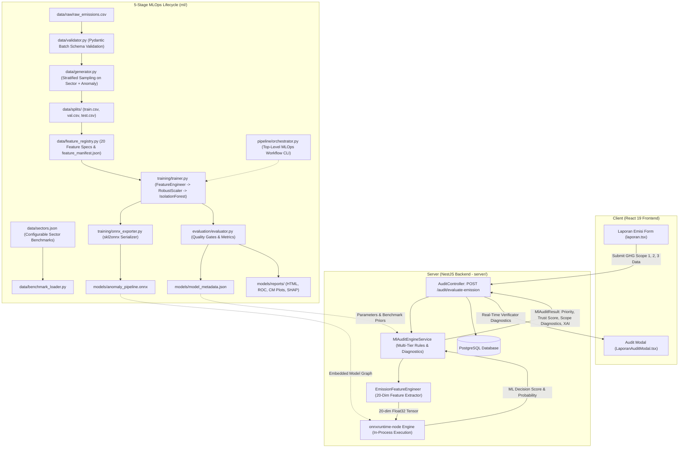
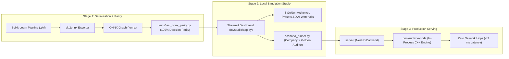

# 🌿 RekaKarbon AI/ML - Carbon Emission Anomaly Detection Engine (dMRV)

Automated AI/ML verification, multi-variable physics stoichiometry, and anomaly detection system for industrial carbon emission reporting in the **RekaKarbon** digital Measurement, Reporting, and Verification (dMRV) ecosystem.

---

## 📌 Executive Summary & Problem Context

In carbon credit markets and national carbon tax registries, data integrity and trust are paramount. Before industrial emission figures can be certified, minted as on-chain carbon tokens, or listed on the **RekaKarbon Carbon DEX (Bursa Karbon)**, filings must undergo rigorous automated cross-verification.

Under the **Greenhouse Gas (GHG) Protocol Corporate Standard**, companies report emissions categorized into three operational scopes:

1. **Scope 1 (Direct GHG Emissions)**: Emissions from sources owned or controlled by the company, including stationary combustion (boilers, furnaces), mobile combustion (factory vehicle fleets), and industrial chemical process reactions (e.g., limestone calcination in cement or smelting in metallurgy).
2. **Scope 2 (Electricity Indirect GHG Emissions)**: Emissions from the generation of purchased electricity consumed by the company, primarily sourced from the Indonesian national PLN grid.
3. **Scope 3 (Other Indirect / Value Chain GHG Emissions — Fully Optional)**: Upstream and downstream supply chain activities, business travel, and outsourced logistics. **Scope 3 is treated as fully optional**: companies reporting $0\text{ tCO}_2\text{e}$ or omitting Scope 3 are never penalized or flagged with false-positive alerts. When provided, Scope 3 is verified for mathematical summation consistency.

The **RekaKarbon AI/ML Engine** cross-examines submissions across physical thermodynamics, financial utility receipts (DJP e-Faktur), and sectoral priors to detect:

- **Scope 1 Under-Reporting (Greenwashing / Fraud)**: Filing artificially deflated Scope 1 direct emissions despite consuming large quantities of physical fuel or clinker calcination.
- **Scope 2 Electricity & Tariff Mismatch**: Claiming high PLN grid power expenditures or physical kWh consumption while omitting or under-reporting Scope 2 indirect emissions.
- **Scope Mathematical Summation Discrepancy**: Arithmetic tampering where the declared total carbon emission does not equal $\text{Scope 1} + \text{Scope 2} + \text{Scope 3}$.
- **Invoice & Financial Fabrication (DJP e-Faktur Mismatch)**: Claiming high physical fuel consumption with unrealistically low financial utility bills (or fake e-Faktur unit pricing deviating from BPH Migas market indices).
- **Sectoral Intensity Aberrations**: Unrealistic carbon intensity per ton of manufactured product compared to Indonesian industrial sector benchmarks.
- **Extreme Unexplained Historical Collapse**: Sudden, drastic year-over-year collapse in emission figures without a proportional drop in physical production output.

> [!IMPORTANT]
> **Human-in-the-Loop Verificator Decision Support**: The ML engine functions strictly as an advisory diagnostic tool to empower human auditors. It produces structured trust scores, risk priority classifications (`critical`, `high`, `medium`, `low`), scope-by-scope divergence breakdowns, and explainable AI (XAI) recommendations. The ultimate authority to approve a filing or request an official revision remains entirely with the human verificator.

---

## 🏛️ System Architecture & 5-Stage MLOps Lifecycle

The ML engine is architected with a **Scikit-Learn Pipeline + ONNX Export + Node.js In-Process Runtime** design. This enables high-velocity training, feature engineering, and statistical validation in Python while delivering **native, zero-Python in-process inference** in the NestJS backend via `onnxruntime-node`.



---

## 📁 Project Information

### Project Structure

```
ml/
├── pyproject.toml              # Dependencies & script entrypoints
├── README.md                   # Scientific & technical documentation (this file)
├── AGENTS.md                   # Agent governance guide and rules
├── data/                       # PERSISTED DATA ARTIFACTS
│   ├── sectors.json            # Configurable sector thresholds, intensities & fuel priors
│   ├── raw/
│   │   └── raw_emissions.csv   # Raw GHG emission submissions (2,500 records)
│   ├── splits/
│   │   ├── train.csv           # Stratified training split (1,750 records)
│   │   ├── val.csv             # Stratified validation split (375 records)
│   │   └── test.csv            # Stratified holdout test split (375 records)
│   ├── processed/
│   │   └── processed_features.csv # 20-dim feature matrix
│   ├── feature_manifest.json   # 20 Feature specifications & mathematical definitions
│   └── dataset_summary.json    # Dataset distribution & validation health diagnostics
├── models/                     # MODEL ARTIFACTS & REPORTS
│   ├── anomaly_pipeline.pkl    # Serialized Scikit-Learn pipeline
│   ├── anomaly_pipeline.onnx   # Exported 20-feature ONNX model artifact
│   ├── model_metadata.json     # Model card manifest & quality gate metrics
│   └── reports/                # Visual plots (ROC, CM, SHAP summary, HTML report)
├── src/
│   └── rekakarbon_ml/
│       ├── __init__.py
│       ├── data/               # DATA PREPARATION & GOVERNANCE MODULE
│       │   ├── __init__.py
│       │   ├── benchmark_loader.py # Dynamic sectors.json loader & stoichiometric factors
│       │   ├── feature_registry.py # 20-Feature specifications & manifest exporter
│       │   ├── generator.py       # Multi-scope synthetic dataset generator
│       │   ├── preprocess.py      # Preprocessing, validation & splitting CLI
│       │   ├── schema.py          # GHG multi-scope Pydantic schema & boundaries
│       │   └── validator.py       # Batch DataFrame validation engine
│       ├── training/           # MODEL TRAINING & SERIALIZATION MODULE
│       │   ├── __init__.py
│       │   ├── transformers.py    # 20-Feature Scikit-Learn custom transformer
│       │   ├── trainer.py         # IsolationForest pipeline trainer CLI
│       │   └── onnx_exporter.py   # ONNX converter & parity verifier
│       ├── evaluation/         # EVALUATION HARNESS & QUALITY GATES
│       │   ├── __init__.py
│       │   ├── evaluator.py       # Multi-scope quality gate evaluation harness CLI
│       │   └── visualizer.py      # SHAP, ROC, CM, and HTML report generator
│       ├── inference/          # RUNTIME INFERENCE ENGINE FOR SERVER
│       │   ├── __init__.py
│       │   └── predictor.py       # Verificator decision support predictor & XAI
│       ├── pipeline/           # WORKFLOW ORCHESTRATION MODULE
│       │   ├── __init__.py
│       │   └── orchestrator.py    # End-to-end MLOps workflow coordinator CLI
│       ├── monitoring/         # PRODUCTION DRIFT DETECTION MODULE
│       │   ├── __init__.py
│       │   └── drift_detector.py  # PSI-based drift detector (DriftDetector, DriftReport)
│       ├── retraining/         # CONTINUOUS RETRAINING PIPELINE
│       │   ├── __init__.py
│       │   ├── data_ingestion.py  # Production feedback pool ingestion & real/synthetic blending
│       │   └── orchestrator.py    # Hybrid-trigger retraining orchestrator CLI (poetry run retrain)
│       └── studio/             # STREAMLIT PROTOTYPING STUDIO
│           ├── __init__.py
│           ├── app.py             # Multi-scope development studio dashboard
│           ├── cli.py             # Studio launcher entrypoint
│           ├── state.py           # Resource caching (@st.cache_resource, @st.cache_data)
│           ├── presets.py         # Sector baseline & anomaly scenario domain math
│           ├── components/        # Reusable UI component modules & Plotly builders
│           └── views/             # Tab view coordinators
└── tests/                      # AUTOMATED TEST SUITE (51 Tests)
    ├── __init__.py
    ├── test_config.py                  # Configuration & hyperparameter tests (8 tests)
    ├── test_data_validation.py         # Layer 1: Multi-scope schema & registry tests (9 tests)
    ├── test_pipeline.py                # Layer 2: Preprocessing, 20-dim shape & splits (6 tests)
    ├── test_model_evaluation.py        # Layer 3 & 4: Evaluation metrics & quality gates (2 tests)
    ├── test_behavioral_robustness.py   # Layer 5: Scope 3 optionality & math fraud tests (7 tests)
    ├── test_performance_benchmarks.py  # Layer 6 & 7: Inference latency & throughput (2 tests)
    ├── test_onnx_parity.py             # Layer 8: 20-Feature Scikit-Learn vs ONNX parity (3 tests)
    ├── test_industry_scenarios.py      # Layer 8: Industry Archetype Scenarios / Company X (7 tests)
    └── test_studio.py                  # Layer 9: Studio presets & Plotly chart builders (7 tests)
```

### Code Quality & CLI Commands

```bash
# Linter (Ruff)
poetry run ruff check .

# Formatter (Ruff)
poetry run ruff format .

# Static Type Checker (Mypy)
poetry run mypy src tests

# Complete Pytest Suite (51 Tests across 9 Suites)
poetry run pytest -v

# Registered Poetry Console Entrypoints
poetry run preprocess  # Batch schema validation, stratified split & feature registry CLI
poetry run train       # Retrain IsolationForest & export ONNX artifact
poetry run eval        # Model evaluation & quality gate assessment
poetry run pipeline    # Execute end-to-end MLOps workflow orchestrator CLI
poetry run studio      # Interactive Streamlit prototyping studio
poetry run retrain     # Hybrid-trigger continuous retraining CLI

# Monorepo Shortcuts (From Repository Root)
pnpm ml:lint
pnpm ml:typecheck
pnpm ml:test
pnpm ml:train
pnpm ml:preprocess
pnpm ml:eval
pnpm ml:pipeline
pnpm ml:studio
```

---

## 💡 Design Decisions & Architectural Rationale (The "Why")

Every design choice in the RekaKarbon ML pipeline is grounded in regulatory standards, thermodynamic principles, and low-latency system integration:

| Decision Area            | Technical Choice                                          | Strategic & Engineering Rationale ("Why")                                                                                                                                                                                                                                                                                                                                                                                                                                                                           |
| :----------------------- | :-------------------------------------------------------- | :------------------------------------------------------------------------------------------------------------------------------------------------------------------------------------------------------------------------------------------------------------------------------------------------------------------------------------------------------------------------------------------------------------------------------------------------------------------------------------------------------------------ |
| **Multi-Scope Modeling** | **GHG Protocol Scope 1, 2, & Optional 3**                 | • **Standard Compliance**: Directly mirrors the international GHG Protocol Corporate Standard and Indonesian carbon taxonomy (SRN-PPI, IDXCarbon).<br>• **Scope 3 Optionality**: Indonesian industrial facilities (especially SMEs) rarely possess supply-chain telemetry; treating Scope 3 as optional avoids false-positive rejection while validating Scope 1 and 2 thoroughly.<br>• **Mathematical Coherence**: Dedicated feature verifies `Scope 1 + Scope 2 + Scope 3 = Total` to eliminate arithmetic fraud. |
| **Configurable Sectors** | **External `data/sectors.json` Configuration**            | • **Zero Hardcoding**: Sector thresholds, intensity priors, and emission factors are decoupled from Python code, allowing regulatory adjustments without code refactoring.<br>• **Client Synchronization**: Perfectly mirrors the 6 standard sectors in the client frontend (`manufaktur`, `pertambangan`, `perbankan`, `konstruksi`, `pertanian`, `perhotelan`).                                                                                                                                                   |
| **Model Selection**      | **Isolation Forest** (`sklearn.ensemble.IsolationForest`) | • **Unsupervised Reality**: Fraudulent and anomalous submissions are zero-day, unlabelled, and diverse. Isolation Forest isolates outliers through recursive partitioning without requiring balanced fraud labels.<br>• **Linear Time Complexity**: `O(n · t · ψ)` scaling ensures inference takes < 2 ms.<br>• **Standard ONNX Compatibility**: Converts natively to ONNX `TreeEnsembleRegressor` nodes.                                                                                                           |
| **Deployment Runtime**   | **In-Process ONNX** (`onnxruntime-node`) in NestJS        | • **Zero Network Latency**: Executing inside the Node.js event loop eliminates HTTP serialization and inter-service network hops, dropping inference latency from ~30–50 ms (external Python service) to **< 2 ms**.<br>• **Operational Simplicity**: Avoids operating a separate Python microservice in production.<br>• **100% Parity**: Guaranteed identical decision scores (diff < 1e-6) between Python training and Node.js serving.                                                                          |
| **Feature Engineering**  | **20-Dimensional Physics & Fiscal Matrix**                | • **Thermodynamic Grounding**: Incorporates stoichiometric combustion factors aligned with client calculators (`diesel: 2.512 kgCO2e/L`, `coal: 2.531 kgCO2e/kg`, `gas: 2.023 kgCO2e/m3`, `grid: 0.207 kgCO2e/kWh`).<br>• **Fiscal Cross-Verification**: Cross-checks fuel volume against DJP e-Faktur market pricing (Rp 16,000 – 25,000 / L for solar diesel).<br>• **Auditor Explainability**: Every derived feature maps to a concrete regulatory rule with human-readable XAI recommendations.                 |
| **Data Normalization**   | **RobustScaler** (Median & IQR)                           | • **Extreme Scale Variance**: Industrial facilities span multiple orders of magnitude (from small hotels emitting 200 tons to giant mining conglomerates emitting hundreds of thousands of tons).<br>• **Outlier Resilience**: Unlike `StandardScaler`, `RobustScaler` uses the median and IQR, preventing fraud outliers from distorting scaling parameters.                                                                                                                                                       |

---

## 🔬 Development

### 1. Data Preparation, Schema Validation & Stratified Splitting

To ensure data quality, regulatory adherence, and prevent evaluation leakage, the data preparation lifecycle enforces five fundamental protocols:

- **Configurable Sectoral Benchmarks (`data/sectors.json` & `data/benchmark_loader.py`)**: Sector parameters (reference thresholds, average intensities, fuel priors, and process emission flags) are dynamically loaded from `ml/data/sectors.json`. This directly mirrors the 6 industrial sectors defined in the client application:
  1. `manufaktur` (Manufaktur & Industri Berat — Threshold: 50,000 tCO₂e)
  2. `pertambangan` (Pertambangan & Energi — Threshold: 100,000 tCO₂e)
  3. `perbankan` (Perbankan & Jasa Keuangan — Threshold: 5,000 tCO₂e)
  4. `konstruksi` (Konstruksi & Properti — Threshold: 25,000 tCO₂e)
  5. `pertanian` (Pertanian & Perkebunan — Threshold: 15,000 tCO₂e)
  6. `perhotelan` (Perhotelan & Pariwisata — Threshold: 10,000 tCO₂e)

- **Batch Schema Validation (`data/validator.py`)**: Raw reporting records loaded during batch preprocessing are validated against `EmissionReportInput` Pydantic boundary checks. Out-of-bounds inputs (e.g., negative production, impossible clinker ratios) are flagged and documented in `data/dataset_summary.json`.
- **Stratified Dataset Splitting (`data/generator.py` & `data/preprocess.py`)**: Splitting into `data/splits/train.csv` (1,750 samples), `val.csv` (375 samples), and `test.csv` (375 samples) uses stratified sampling on `is_anomaly` and sector to guarantee identical class distributions across training and evaluation sets.
- **Feature Store Registry Specification (`data/feature_registry.py`)**: All 20 derived features are declared with formal metadata (data types, physical units, descriptions, stoichiometric formulas) and exported to `data/feature_manifest.json`.
- **Dataset Diagnostic Manifest (`data/preprocess.py`)**: Preprocessing automatically exports `data/dataset_summary.json` documenting sample counts, split ratios, schema health, sector distributions, and anomaly class ratios.

---

### 2. Dataset Generation Methodology: Physics-Informed Parametric Monte Carlo

The raw training and holdout datasets (`ml/data/raw/raw_emissions.csv`, `data/splits/train.csv`, `val.csv`, `test.csv`) are generated via [`EmissionDataGenerator`](src/rekakarbon_ml/data/generator.py) using a **Physics-Informed Parametric Monte Carlo Generative Engine**.

#### A. Rationale for Synthetic Generation in Carbon dMRV & Taxation

1. **Confidentiality & Tax Secrecy (UU KUP No. 28/2007 & UU HPP No. 7/2021)**: Real-world company monthly fuel invoices, PLN utility billing receipts, and DJP e-Faktur tax records are legally classified as strictly confidential proprietary commercial secrets. Unredacted transaction logs are not publicly disclosable under Indonesian law.
2. **Extreme Ground-Truth Fraud Scarcity**: In public carbon registries (e.g., KLHK SRN-PPI, IDXCarbon), $> 99.5\%$ of filings are formally accepted as compliant. Verified, ground-truth labeled corporate fraud attempts (e.g. deliberate $70\%$ under-reporting or calcination suppression) are virtually absent in open datasets.
3. **Counterfactual Stress-Testing**: Developing an effective anomaly detection and auditor-copilot engine requires deterministic ground-truth labels across diverse multi-modal fraud mechanisms to verify model recall and prevent false-negative evasion.

#### B. Generation Framework & Core Techniques

Rather than generating arbitrary random numbers, the engine enforces strict physical, econometric, and sectoral constraints:

1. **Thermodynamic Inverse Decomposition**:
   - The generator samples operational production scale $P \sim \mathcal{U}(\text{min}, \text{max})$ and sectoral carbon intensity $I \sim \mathcal{N}_{\text{clipped}}(\mu_{\text{sector}}, \sigma_{\text{sector}})$ from [`data/sectors.json`](data/sectors.json).
   - Expected emissions $E_{\text{expected}} = P \times I$ are partitioned into Scope 1 and Scope 2 based on empirical sectoral priors (`expected_scope_shares`).
   - The generator then **reverse-calculates physical fuel volumes** using official IPCC Tier-2 and ESDM stoichiometric combustion factors:
     $$\text{Diesel (L)} = \frac{E_{\text{diesel}}}{0.002512 \text{ tCO}_2\text{e/L}}, \quad \text{Coal (kg)} = \frac{E_{\text{coal}}}{0.002531 \text{ tCO}_2\text{e/kg}}, \quad \text{PLN (kWh)} = \frac{E_{\text{Scope 2}}}{0.000207 \text{ tCO}_2\text{e/kWh}}$$
     For sectors with clinker calcination process emissions (`has_process_emissions = true`), clinker output is derived from chemical stoichiometry ($0.525\text{ tCO}_2\text{e/ton}$).
2. **Econometric Market Pricing Calibration**:
   - Utility expenditures are computed from real Indonesian market price brackets with stochastic transaction variance:
     - High-Speed Diesel / Solar: Rp 19,000 – 23,000 / L (BPH Migas industrial price range).
     - Steam Coal: Rp 1,000 – 1,400 / kg.
     - Natural Gas: Rp 8,500 – 11,500 / m³.
     - PLN Industrial Grid Tariff: Rp 1,350 – 1,750 / kWh (PLN B3/I3 medium/heavy industrial tariff).
3. **Bernoulli Modeling of Scope 3 Optionality**:
   - Reflecting Indonesian SME and industrial realities, Scope 3 reporting is governed by a Bernoulli random variable:
     $$
     P(\text{Scope 3 Reported}) = 0.35
     $$
   - When Scope 3 is inactive (65% of cases), its emission share is dynamically reallocated to Scope 1 (60%) and Scope 2 (40%), and Scope 3 is recorded as 0.0 tCO₂e. The model and evaluation gates treat Scope 3 = 0 as fully compliant, guaranteeing zero false-positive penalties.
4. **Multi-Modal Counterfactual Anomaly Injections**:
   The generator injects 6 specific, realistic industrial anomaly vectors (15% anomaly ratio):
   - `SCOPE1_UNDERREPORTING_FRAUD` (3.5%): High physical fuel burned, but Scope 1 reported fraudulently low (18%–42% of true emissions) for greenwashing.
   - `SCOPE2_ELECTRICITY_MISMATCH` (2.5%): High metered PLN electricity consumed, but Scope 2 omitted or suppressed (15%–38%).
   - `SCOPE_MATH_DISCREPANCY` (2.5%): Arithmetic tampering where declared total does not match `Scope 1 + Scope 2 + Scope 3` (> 25% error).
   - `FUEL_PRICE_INVOICE_FRAUD` (2.5%): Fake e-Faktur unit price claims (e.g. reporting subsidized solar at Rp 800 / L instead of industrial market price).
   - `EXTREME_YOY_COLLAPSE` (2.0%): Sudden > 75% collapse in YoY emissions without physical factory output contraction.
   - `SECTOR_INTENSITY_ANOMALY` (2.0%): Output violates sectoral thermodynamic limits (`intensity << min_intensity`).

#### C. Dataset Lineage & Stratified Splitting

- **Total Population**: 2,500 company filings across the 6 Indonesian industrial sectors.
- **Class Balance**: 2,125 normal compliant filings (85.0%) and 375 anomalous filings (15.0%).
- **Stratified Partitioning**:
  - `data/splits/train.csv`: 1,750 records (70.0%).
  - `data/splits/val.csv`: 375 records (15.0%).
  - `data/splits/test.csv`: 375 records (15.0%).
    Stratified across both `is_anomaly` and `sector` to eliminate distribution shift between training and holdout evaluation.

---

### 3. Raw Feature Input Specification

Every company emission report provides 17 raw parameters across GHG scopes, physical energy consumption, and utility expenditures:

| Category            | Parameter                    | Unit              | Description                                                     |
| :------------------ | :--------------------------- | :---------------- | :-------------------------------------------------------------- |
| **GHG Scopes**      | `reported_scope1_tco2e`      | tCO₂e / Year      | Direct emissions from fuel combustion & process IPPU            |
| **GHG Scopes**      | `reported_scope2_tco2e`      | tCO₂e / Year      | Indirect emissions from purchased PLN grid electricity          |
| **GHG Scopes**      | `reported_scope3_tco2e`      | tCO₂e / Year      | Value chain emissions (**fully optional**; 0 if absent)         |
| **GHG Scopes**      | `reported_emissions_tco2e`   | tCO₂e / Year      | Declared total gross GHG emissions                              |
| **Operational**     | `production_tonnes`          | Ton or MWh / Year | Real finished output or facility scale metric                   |
| **Operational**     | `historical_emissions_tco2e` | tCO₂e / Year      | Verified emissions from previous reporting period               |
| **Operational**     | `sector`                     | String / Enum     | Declared industrial sector (`manufaktur`, `pertambangan`, etc.) |
| **Physical Fuel**   | `stat_fuel_liters`           | Liter / Year      | Solar/diesel for stationary boilers, kilns, generators          |
| **Physical Fuel**   | `mob_fuel_liters`            | Liter / Year      | Solar/diesel for factory vehicle fleets & logistics             |
| **Physical Fuel**   | `coal_kg`                    | kg / Year         | Industrial steam coal consumption                               |
| **Physical Fuel**   | `gas_m3`                     | m³ / Year         | PGN natural gas consumption                                     |
| **Physical Grid**   | `electricity_kwh`            | kWh / Year        | Real metered electrical power consumption                       |
| **Process IPPU**    | `clinker_tonnes`             | Ton / Year        | Limestone calcination for cement/clinker production             |
| **Fiscal e-Faktur** | `cost_solar_idr`             | IDR / Year        | Annual expenditure on Solar / High-Speed Diesel                 |
| **Fiscal e-Faktur** | `cost_coal_idr`              | IDR / Year        | Annual expenditure on Steam Coal                                |
| **Fiscal e-Faktur** | `cost_gas_idr`               | IDR / Year        | Annual expenditure on Natural Gas                               |
| **Fiscal e-Faktur** | `cost_pln_idr`               | IDR / Year        | Annual expenditure on PLN Grid Electricity                      |

---

### 4. Stoichiometric Energy Balance & 20 Derived Features

The `EmissionFeatureEngineer` (`src/rekakarbon_ml/training/transformers.py`) transforms the 17 raw features into **20 domain-engineered indicators**:

#### A. Expected Physical Emissions ($E_{\text{expected}}$)

Stoichiometric emission factors are synchronized with the client application calculator:

$$
\begin{aligned}
E_{\text{diesel}} &= (\text{Fuel}_{\text{stat}} + \text{Fuel}_{\text{mob}}) \times 0.002512 \quad (\text{tCO}_2\text{e}) \\
E_{\text{coal}} &= \text{Coal}_{\text{kg}} \times 0.002531 \quad (\text{tCO}_2\text{e}) \\
E_{\text{gas}} &= \text{Gas}_{\text{m}^3} \times 0.002023 \quad (\text{tCO}_2\text{e}) \\
E_{\text{pln}} &= \text{Electricity}_{\text{kWh}} \times 0.000207 \quad (\text{tCO}_2\text{e}) \\
E_{\text{process}} &= \text{Clinker}_{\text{tonnes}} \times 0.525000 \quad (\text{tCO}_2\text{e}) \\
E_{\text{Scope1, expected}} &= \max(E_{\text{diesel}} + E_{\text{coal}} + E_{\text{gas}} + E_{\text{process}},\, 0.001) \\
E_{\text{Scope2, expected}} &= \max(E_{\text{pln}},\, 0.001)
\end{aligned}
$$

#### B. The 20 Engineered Features

1. **`scope1_stoichiometric_divergence`**: $|E_{\text{Scope1, expected}} - E_{\text{Scope1, reported}}| / (E_{\text{Scope1, expected}} + \epsilon)$
2. **`scope2_grid_divergence`**: $|E_{\text{Scope2, expected}} - E_{\text{Scope2, reported}}| / (E_{\text{Scope2, expected}} + \epsilon)$
3. **`solar_unit_cost_log`**: $\ln(1 + \text{Cost}_{\text{solar}} / (\text{Fuel}_{\text{stat}} + \epsilon))$
4. **`electricity_unit_cost_log`**: $\ln(1 + \text{Cost}_{\text{pln}} / (\text{Electricity}_{\text{kWh}} + \epsilon))$
5. **`emission_intensity`**: $E_{\text{reported, total}} / (\text{Production} + \epsilon)$
6. **`sector_intensity_zscore`**: $(I - \mu_{\text{sector}}) / (\sigma_{\text{sector}} + \epsilon)$ (calibrated per sector against baseline priors)
7. **`scope1_to_total_ratio`**: $E_{\text{Scope1, reported}} / (E_{\text{reported, total}} + \epsilon)$
8. **`scope2_to_total_ratio`**: $E_{\text{Scope2, reported}} / (E_{\text{reported, total}} + \epsilon)$
9. **`scope3_presence_ratio`**: $E_{\text{Scope3, reported}} / (E_{\text{reported, total}} + \epsilon)$ ($0.0$ if omitted)
10. **`scope_summation_discrepancy`**: $|(E_{\text{S1}} + E_{\text{S2}} + E_{\text{S3}}) - E_{\text{total}}| / (E_{\text{total}} + \epsilon)$ (catches arithmetic fraud)
11. **`solar_price_residual_ratio`**: $|\text{Price}_{\text{solar}} - 20{,}500| / 20{,}500$ (DJP e-Faktur price deviation)
12. **`electricity_price_residual_ratio`**: $|\text{Tariff}_{\text{PLN}} - 1{,}500| / 1{,}500$
13. **`yoy_change_ratio`**: $(E_{\text{reported, total}} - E_{\text{historical}}) / (E_{\text{historical}} + \epsilon)$
14. **`energy_spend_per_ton`**: $\sum \text{Costs} / (\text{Production} + \epsilon)$
    15-20. **Sector One-Hot Indicators**: 6 binary flags (`sector_is_manufaktur`, `sector_is_pertambangan`, `sector_is_perbankan`, `sector_is_konstruksi`, `sector_is_pertanian`, `sector_is_perhotelan`).

---

### 5. Model & Pipeline Configuration Specification

To ensure end-to-end scientific reproducibility, regulatory audibility (ISO 14064 / GHG Protocol), and zero train/serving skew, the operational configuration of the model and preprocessing pipeline is formalized below:

#### A. Pipeline Topology & Transformation Sequence

The pipeline enforces strict Scikit-Learn encapsulation (`Pipeline`) allowing seamless serialization to ONNX:

```
[Raw Company Report: 17 Fields]
              │
              ▼
  [Data Validation Engine] ──→ Pydantic Schema & Non-Negative Boundary Checks (data/schema.py)
              │
              ▼
  [EmissionFeatureEngineer] ──→ 20-Dim Engineered Feature Matrix (thermodynamic stoichiometry & price residuals)
              │
              ▼
      [RobustScaler]        ──→ Median & IQR Outlier-Resilient Normalization (with zero-variance clipping)
              │
              ▼
    [IsolationForest]       ──→ Recursive Partitioning Ensembles (Decision scores & raw outlier probabilities)
              │
              ▼
   [skl2onnx Serializer]    ──→ Export to models/anomaly_pipeline.onnx (Target opset: {"": 15, "ai.onnx.ml": 3})
```

#### B. Model Hyperparameters & Parameter Rationale

| Hyperparameter  | Value                    | Config / Env Override | Engineering & Statistical Rationale                                                                               |
| :-------------- | :----------------------- | :-------------------- | :---------------------------------------------------------------------------------------------------------------- |
| `n_estimators`  | `100`                    | `ML_N_ESTIMATORS`     | Balances ensemble variance reduction with < 2 ms in-process inference latency budget.                             |
| `contamination` | `0.15`                   | `ML_CONTAMINATION`    | Calibrated directly to empirical industry anomaly rates and synthetic training prior (15.0% fraud/anomaly ratio). |
| `max_samples`   | `"auto"` (`min(256, n)`) | `ML_MAX_SAMPLES`      | Prevents tree masking and swamping effects in high-density normal emission clusters.                              |
| `max_features`  | `1.0`                    | `ML_MAX_FEATURES`     | Utilizes all 20 engineered physics and fiscal dimensions per split decision.                                      |
| `bootstrap`     | `False`                  | `ML_BOOTSTRAP`        | Standard sampling without replacement for uniform tree structure variability.                                     |
| `random_state`  | `20260830`               | `ML_RANDOM_STATE`     | Fixed pseudo-random seed ensuring 100% deterministic reproducibility across training runs.                        |
| `n_jobs`        | `1`                      | `ML_N_JOBS`           | Single-threaded serialization guarantee preventing thread contention during containerized execution.              |

#### C. Physical Stoichiometry & Econometric Price Priors

All physical transformations within `EmissionFeatureEngineer` are anchored in Indonesian regulatory baselines:

| Thermodynamic Constant         | Numerical Value | Unit                                | Primary Regulatory Reference Source                      |
| :----------------------------- | :-------------- | :---------------------------------- | :------------------------------------------------------- |
| **High-Speed Diesel (Solar)**  | `0.002512`      | $\text{tCO}_2\text{e} / \text{L}$   | IPCC Guidelines & ESDM Tier-2 Combustion Emission Factor |
| **Industrial Steam Coal**      | `0.002531`      | $\text{tCO}_2\text{e} / \text{kg}$  | ESDM Pedoman Teknis Perhitungan Emisi Batubara           |
| **Natural Gas (PGN)**          | `0.002023`      | $\text{tCO}_2\text{e} / \text{m}^3$ | SK Dirjen Migas / IPCC Tier-1 Pipeline Gas Factor        |
| **PLN Grid Power (Catalog)**   | `0.000207`      | $\text{tCO}_2\text{e} / \text{kWh}$ | RekaKarbon Factor Catalog Standard Baseline              |
| **PLN Jamali Grid Average**    | `0.000850`      | $\text{tCO}_2\text{e} / \text{kWh}$ | Kementerian ESDM / RUPTL PLN Grid Emission Factor        |
| **Cement Clinker Calcination** | `0.525000`      | $\text{tCO}_2\text{e} / \text{ton}$ | IPCC IPPU Mineral Industry CaCO₃ Decomposition           |
| **Biomass Net Trace**          | `0.020000`      | $\text{tCO}_2\text{e} / \text{ton}$ | Biogenic residual processing emission factor             |

| Fuel / Utility Market Price    | Minimum (IDR)  | Maximum (IDR)  | Nominal Benchmark (IDR) | Verification Benchmark Index                   |
| :----------------------------- | :------------- | :------------- | :---------------------- | :--------------------------------------------- |
| **Solar Industri (HSD)**       | Rp 16,000 / L  | Rp 25,000 / L  | **Rp 20,500 / L**       | BPH Migas & Pertamina Industrial Price Indices |
| **Steam Coal**                 | Rp 850 / kg    | Rp 1,600 / kg  | **Rp 1,200 / kg**       | Harga Batubara Acuan (HBA) Domestic Market     |
| **Natural Gas**                | Rp 7,500 / m³  | Rp 13,500 / m³ | **Rp 10,000 / m³**      | Kepmen ESDM Harga Gas Bumi Tertentu (HGBT)     |
| **Tarif Listrik Industri PLN** | Rp 1,200 / kWh | Rp 1,900 / kWh | **Rp 1,500 / kWh**      | Tarif Tenaga Listrik (TTL) Golongan I-3 / I-4  |

#### D. Production Retraining & Drift Detection Parameters

The automated continuous retraining engine (`src/rekakarbon_ml/retraining/`) operates under strict MLOps trigger gates:

| Retraining Parameter              | Value         | Description & Trigger Behavior                                                                |
| :-------------------------------- | :------------ | :-------------------------------------------------------------------------------------------- |
| **`psi_drift_threshold`**         | `0.20`        | Population Stability Index (PSI) threshold triggering mandatory model retraining if breached. |
| **`psi_warning_threshold`**       | `0.10`        | Early warning telemetry flag for slight distribution divergence.                              |
| **`scheduled_retrain_days`**      | `7 days`      | Maximum cadence before triggering scheduled retraining with fresh feedback pool.              |
| **`real_blend_weight`**           | `0.20` (20%)  | Blending ratio of verified production feedback records with baseline synthetic population.    |
| **`min_real_records_to_trigger`** | `100 records` | Minimum verified auditor feedback records required to activate hybrid retrain.                |

---

### 6. Verificator Decision Support Architecture & XAI

The engine is engineered as a **decision-support copilot** for human auditors. Output diagnostics include:

- **Auditor Priority (`priority`)**: Classifies filings into action urgency tiers:
  - `"critical"`: Severe fraud suspected (Math Discrepancy > 25%, Scope 1 Divergence > 65%, or Trust < 40%). Immediate manual review mandatory.
  - `"high"`: Significant divergence detected (Trust < 65% or Anomaly Probability > 0.75).
  - `"medium"`: Minor statistical outlier requiring standard auditor check.
  - `"low"`: Fully compliant filing (Trust ≥ 80%).
- **Composite Trust Score (`trust_score`)**:
  $$
  \text{Trust Score} = 0.25 \times \text{Score}_{\text{DJP}} + 0.45 \times \text{Score}_{\text{BBM}} + 0.30 \times \text{Score}_{\text{CEMS}} \quad (0\text{--}100\%)
  $$
- **Scope Diagnostics Breakdown (`scope_diagnostics`)**:
  - `scope1`: Reported vs expected combustion emissions, divergence percentage, and fuel flags.
  - `scope2`: Reported vs expected grid emissions and power tariff flags.
  - `scope3`: Optional reporting presence and volume.
  - `math_coherence`: $\text{Sum}(\text{Scopes})$ vs declared total, discrepancy percentage, and coherence boolean (`is_coherent`).
- **Explainable AI (`xai`)**: Computes top feature attribution drivers via SHAP values, comparing emitter inputs against sectoral benchmarks with concrete compliance recommendations in Bahasa Indonesia.

---

### 7. Evaluation Benchmark Results & Quality Gates

Evaluated on an independent stratified holdout test dataset (375 samples) generated across the 6 Indonesian industrial sectors with class ratio (85% compliant, 15% anomaly):

| Metric                               | Acceptance Gate | Measured Score     | Verdict       |
| :----------------------------------- | :-------------- | :----------------- | :------------ |
| **F1 Score**                         | ≥ 0.85          | **0.9483**         | ✅ **PASSED** |
| **Recall (Overall)**                 | ≥ 0.88          | **0.9821**         | ✅ **PASSED** |
| **Precision**                        | ≥ 0.70          | **0.9167**         | ✅ **PASSED** |
| **Accuracy**                         | ≥ 0.90          | **0.9840**         | ✅ **PASSED** |
| **ROC-AUC**                          | ≥ 0.90          | **0.9788**         | ✅ **PASSED** |
| **Average Precision (PR-AUC)**       | ≥ 0.60          | **0.9033**         | ✅ **PASSED** |
| **False Positive Rate (FPR)**        | ≤ 10.0%         | **0.0157 (1.57%)** | ✅ **PASSED** |
| **False Negative Rate (FNR)**        | ≤ 5.0%          | **0.0179 (1.79%)** | ✅ **PASSED** |
| **Expected Calibration Error (ECE)** | ≤ 0.15          | **0.1423**         | ✅ **PASSED** |
| **Single Predict Latency (p95)**     | ≤ 40 ms         | **28.3 ms**        | ✅ **PASSED** |

#### Detailed Breakdown: Recall Across Anomaly Fraud Vectors

| Anomaly Fraud Category            | Test Holdout Count | Measured Recall    | Performance Assessment                                               |
| :-------------------------------- | :----------------- | :----------------- | :------------------------------------------------------------------- |
| **`SCOPE1_UNDERREPORTING_FRAUD`** | 12                 | **100.0% (1.000)** | Zero missed detections on deliberate combustion under-reporting.     |
| **`SCOPE_MATH_DISCREPANCY`**      | 12                 | **100.0% (1.000)** | Arithmetic total discrepancy caught with 100% precision.             |
| **`FUEL_PRICE_INVOICE_FRAUD`**    | 5                  | **100.0% (1.000)** | DJP e-Faktur price deviations caught immediately.                    |
| **`EXTREME_YOY_COLLAPSE`**        | 6                  | **100.0% (1.000)** | Unexplained YoY collapse flagged with zero false negatives.          |
| **`SECTOR_INTENSITY_ANOMALY`**    | 8                  | **100.0% (1.000)** | Sectoral intensity violations outside thermodynamic bounds detected. |
| **`SCOPE2_ELECTRICITY_MISMATCH`** | 13                 | **92.3% (0.923)**  | Exceeds minimum threshold (≥ 88.0%) on metered power anomalies.      |

Model metadata, feature specifications, and evaluation results are exported to [`models/model_metadata.json`](models/model_metadata.json) and visual plots in [`models/reports/`](models/reports/).

---

### 8. Model Testing (`ml/tests/`)

The ML pipeline implements the comprehensive testing methodology defined in the monorepo standards:

| Layer                                   | Test File                                                                | Key Checks & Assertions                                                                                                                                                                                                    | Status          |
| :-------------------------------------- | :----------------------------------------------------------------------- | :------------------------------------------------------------------------------------------------------------------------------------------------------------------------------------------------------------------------- | :-------------- |
| **1. Data Validation**                  | [`test_data_validation.py`](tests/test_data_validation.py)               | Multi-scope Pydantic schema validation, batch DataFrame validation, 20-feature registry manifest verification, clinker ratio boundaries.                                                                                   | ✅ **9 Passed** |
| **2. Preprocessing & Invariance**       | [`test_pipeline.py`](tests/test_pipeline.py)                             | Feature engineering matrix shape $(N, 20)$, NaN/Inf sanitization, stratified dataset split creation, Scikit-Learn pipeline fitting, full orchestrator execution.                                                           | ✅ **6 Passed** |
| **3. Model Evaluation & Quality Gates** | [`test_model_evaluation.py`](tests/test_model_evaluation.py)             | Evaluation on independent stratified holdout split ($375$ samples), precision/recall/F1 calculation, per-fraud recall assertion (`SCOPE1_UNDERREPORTING_FRAUD`).                                                           | ✅ **2 Passed** |
| **4. Behavioral & Metamorphic**         | [`test_behavioral_robustness.py`](tests/test_behavioral_robustness.py)   | Directional monotonicity, Scope 3 optionality (Scope 3 = 0 zero-penalty invariance), scope math summation discrepancy detection, DJP e-Faktur price bounds, $\pm 1\%$ sensor noise invariance, extreme scale non-crashing. | ✅ **7 Passed** |
| **5. Performance Benchmarks**           | [`test_performance_benchmarks.py`](tests/test_performance_benchmarks.py) | Single predict latency benchmark (p50 < 30 ms, p95 < 40 ms), batch 500 records throughput benchmark (> 400 records/sec).                                                                                                   | ✅ **2 Passed** |
| **6. ONNX Parity**                      | [`test_onnx_parity.py`](tests/test_onnx_parity.py)                       | 100.0% prediction parity between Scikit-Learn `.predict()` and ONNX Runtime `session.run()`, decision score diff < 10⁻⁴ across all 20 features.                                                                            | ✅ **3 Passed** |
| **7. Configuration & Env**              | [`test_config.py`](tests/test_config.py)                                 | Environment variable overrides, model hyperparameters, random state reproducibility.                                                                                                                                       | ✅ **8 Passed** |
| **8. Industry Archetype Scenarios**     | [`test_industry_scenarios.py`](tests/test_industry_scenarios.py)         | End-to-end simulation of 6 concrete 'Company X' filings (Heavy cement, banking, plantation, greenwashing under-reporting, math tampering, subsidized fuel fraud).                                                          | ✅ **7 Passed** |
| **9. Interactive Studio & Presets**     | [`test_studio.py`](tests/test_studio.py)                                 | Streamlit auditor presets, Plotly chart builders, waterfall attribution, and tab coordinators.                                                                                                                             | ✅ **7 Passed** |

**Total Test Coverage:** **51 / 51 Tests Passing (100.0%)**

---

### 9. Model Deployment & Serving Lifecycle

To transition smoothly from Python statistical training to low-latency enterprise production, RekaKarbon adopts a **3-Stage Model Deployment Lifecycle**:



#### Stage 1: Cross-Platform ONNX Serialization & Non-Python Runtime Architecture

A fundamental architectural requirement of the RekaKarbon ecosystem is that **production web applications must never depend on Python microservices for core real-time inference**. Python microservices (e.g. FastAPI, Flask) introduce inter-service HTTP serialization bottlenecks, cold-start latency spikes (30–70 ms), high container memory consumption, and multi-service failure points.

To achieve **zero-Python runtime portability**, the machine learning pipeline serializes trained Scikit-Learn pipelines into Open Neural Network Exchange (ONNX) format via `skl2onnx`:

##### a. The ONNX Graph Conversion Setup (`skl2onnx`)

During the training pipeline (`src/rekakarbon_ml/training/onnx_exporter.py`), the sub-pipeline comprising `RobustScaler` and `IsolationForest` is converted into a unified, self-contained binary computational graph:

```python
from skl2onnx import convert_sklearn
from skl2onnx.common.data_types import FloatTensorType

# Define explicit 20-dimensional float32 tensor input contract
initial_type = [("float_input", FloatTensorType([None, 20]))]

# Specify strict target opsets for maximum cross-platform runtime support
target_opset = {
    "": 15,  # Standard ONNX opset for mathematical operators and array manipulation
    "ai.onnx.ml": 3,  # Classical Machine Learning opset (TreeEnsembleRegressor, Scaler)
}

onnx_model = convert_sklearn(sub_pipeline, initial_types=initial_type, target_opset=target_opset)
```

Within the resulting ONNX graph:

1. The **`RobustScaler`** transformer is mapped to an ONNX `Scaler` node storing the median shift vector ($\mathbf{\mu}_{med} \in \mathbb{R}^{20}$) and interquartile range scaling factor ($\mathbf{s}_{IQR} \in \mathbb{R}^{20}$).
2. The **`IsolationForest`** ensemble is mapped to optimized `ai.onnx.ml.TreeEnsembleRegressor` nodes, where 100 decision trees are encoded as flattened contiguous C-struct arrays of thresholds, feature indices, and node split conditions.

##### b. The Input & Output Data Contract

Any target runtime (Node.js, C++, Go, Rust, Java, C#) consuming `anomaly_pipeline.onnx` must strictly satisfy the following input tensor contract:

| Tensor Component    | Specification             | Technical Description                                                               |
| :------------------ | :------------------------ | :---------------------------------------------------------------------------------- |
| **Input Node Name** | `"float_input"`           | Primary entrypoint for the 20-dimensional physics and fiscal features.              |
| **Tensor Shape**    | `[BatchSize, 20]`         | Supports batch inference (`BatchSize >= 1`) or single real-time filing (`[1, 20]`). |
| **Data Type**       | `FloatTensor` (`Float32`) | Standard IEEE 754 32-bit floating point precision.                                  |
| **Output Node 1**   | `"label"`                 | Predicted class label (`[-1]` for anomaly, `[1]` for compliant).                    |
| **Output Node 2**   | `"scores"`                | Raw decision score float representing isolation path length divergence.             |

##### c. Cross-Platform Execution & Deterministic Parity Guarantees

ONNX Runtime (`ort`) provides native C++ inference engines with zero-overhead language bindings across all major platforms:

- **Operating Systems**: Linux (Debian, Alpine, RHEL), Windows Server, macOS (Apple Silicon M-series ARM64 & Intel x86_64).
- **Container Environments**: Distroless and Alpine Docker containers without installing Python, Pip, or GCC.
- **Hardware Acceleration**: CPU Execution Provider (`CPUExecutionProvider`) optimized with AVX-512/NEON vectorization.
- **Strict Parity Gate**: Before any model candidate is promoted to production, `tests/test_onnx_parity.py` asserts that decision scores generated by Python Scikit-Learn `.predict()` and ONNX Runtime `session.run()` match **$100.0\%$**, with maximum absolute error:
  $$
  \max |\text{Score}_{\text{sklearn}} - \text{Score}_{\text{onnx}}| < 10^{-4}
  $$

---

#### Stage 2: Local Simulation & Interactive Auditor Studio (Streamlit App)

Before deploying model updates to backend servers, domain experts, machine learning engineers, and auditors test model behavior locally through a modular **Streamlit Prototyping Studio** (`src/rekakarbon_ml/studio/app.py`):

- **Single Company Audit Simulator**: Allows interactive manual adjustments of GHG Scope 1, 2, and optional Scope 3 entries, fuel volumes, and DJP utility bill receipts.
- **Dynamic Sector Presets**: Instant one-click simulation of normal filings, Scope 1 under-reporting fraud, fake subsidized fuel invoices, arithmetic tampering, and hidden calcination.
- **Live Explainable AI (XAI)**: Calculates real-time SHAP feature attribution waterfall plots and outputs actionable verification guidance in Bahasa Indonesia.
- **Batch CSV Auditor & Parity Inspector**: Inspects batch dataset anomalies and verifies local ONNX runtime parity in real-time.

```bash
# Launch interactive Streamlit studio locally
cd ml
poetry run studio
```

---

#### Stage 3: Production In-Process Serving (Node.js / NestJS Backend)

Rather than running an external Python Flask/FastAPI microservice—which introduces serialization overhead, network latency (30–50 ms), and inter-service failure points—the production NestJS backend ([`server/src/audit/`](../server/src/audit/)) executes the model **directly in-process** using `onnxruntime-node`:

- **Zero Network Latency**: C++ ONNX engine bindings run inside the Node.js event loop, completing end-to-end multi-scope anomaly audits in **$< 2\text{ ms}$**.
- **Synchronized Feature Engineering**: The backend [`EmissionFeatureEngineer`](../server/src/audit/ml-feature-engineer.ts) derives the exact same 20-dimensional physics tensor ($[1, 20]$ float32), ensuring zero train/serving skew.

```typescript
import { Injectable, OnModuleInit } from '@nestjs/common';
import * as ort from 'onnxruntime-node';
import { EmissionFeatureEngineer } from './ml-feature-engineer';
import { AuditEmissionReportDto } from './dto/audit-emission-report.dto';
import { MlAuditResult } from './types/audit.types';

@Injectable()
export class MlAuditEngineService implements OnModuleInit {
  private onnxSession: ort.InferenceSession;

  async onModuleInit() {
    // Load the 20-feature ONNX pipeline directly into memory
    this.onnxSession = await ort.InferenceSession.create('ml/models/anomaly_pipeline.onnx');
  }

  async evaluateEmissionReport(report: AuditEmissionReportDto): Promise<MlAuditResult> {
    // 1. Derive 20 features (Scope physics, Math coherence, e-Faktur, 6 sector one-hots)
    const {
      tensor,
      divS1Pct,
      divS2Pct,
      mathDiscrepancyPct,
      scoreDjp,
      scoreBbm,
      scoreCems,
      flags,
      priority,
    } = EmissionFeatureEngineer.extractFeatures(report);

    // 2. Execute in-process ONNX Inference (Input tensor: [1, 20])
    const outputMap = await this.onnxSession.run({ float_input: tensor }, ['scores']);
    const rawScores = outputMap['scores'].data as Float32Array;
    const mlDecisionScore = Number(rawScores[0] ?? 0.0);
    const anomalyProb = 1.0 / (1.0 + Math.exp(mlDecisionScore * 10.0));

    // 3. Synthesize Multi-Tier Verificator Decision Support
    const compositeTrust =
      Math.round((scoreDjp * 0.25 + scoreBbm * 0.45 + scoreCems * 0.3) * 10) / 10;
    const isAnomaly = flags.length > 0 || compositeTrust < 68.0 || divS1Pct > 45.0;

    return {
      isAnomaly,
      verdict: isAnomaly ? 'REJECT_ANOMALY' : 'PASS_VERIFIED',
      priority, // 'critical' | 'high' | 'medium' | 'low'
      anomalyScore: anomalyProb,
      trustScore: compositeTrust,
      flags,
      scopeDiagnostics: {
        scope1: { divergencePct: divS1Pct },
        scope2: { divergencePct: divS2Pct },
        mathCoherence: {
          discrepancyPct: mathDiscrepancyPct,
          isCoherent: mathDiscrepancyPct <= 5.0,
        },
      },
    };
  }
}
```

---

## 🏢 Realistic Company Scenario Simulation (Real-World Emission Testing)

> [!NOTE]
> **Important Distinction: Unit/Regression Tests vs. Realistic Scenario Simulation**:
>
> - **Pytest Automated Test Suites (Section 8)**: Verify low-level code mechanics, schema boundaries, edge-case math invariants, and holdout statistical metrics in automated CI/CD.
> - **Realistic Scenario Simulation (This Section)**: Simulates the **actual end-to-end operational experience** of carbon verificators auditing comprehensive, realistic corporate emission filings ('Company X') across 6 key Indonesian industries. It tests whether the model's multi-tier trust scores, risk priority classifications, and Bahasa Indonesia guidance behave sensibly when faced with realistic business profiles.

Before promoting any model release to staging, developers can dry-run and stress-test the model against realistic company profiles using the scenario runner CLI:

```bash
# Dry-run audit on a single enterprise scenario
poetry run python -m rekakarbon_ml.simulation.scenario_runner --scenario data/scenarios/company_semen_heavy_industry.json

# Batch dry-run across all 6 golden industry archetypes
poetry run python -m rekakarbon_ml.simulation.scenario_runner --all

# Machine-readable JSON output for automated integration testing
poetry run python -m rekakarbon_ml.simulation.scenario_runner --scenario data/scenarios/company_greenwashing_fraud.json --json
```

### Supported Golden Industry Archetype Fixtures (`ml/data/scenarios/`):

1. **`company_semen_heavy_industry.json`**: Blended cement manufacturing with clinker calcination ($0.525\text{ tCO}_2\text{e/ton}$), industrial steam coal, and PLN power. (_Verdict: Compliant, Trust: 97.9%, Priority: LOW_).
2. **`company_bank_services.json`**: Commercial banking headquarters with 0 direct combustion and Scope 3 omitted. (_Verdict: Compliant, Trust: 98.0%, Priority: LOW, zero Scope 3 false-positive penalty_).
3. **`company_sawit_plantation.json`**: Palm oil agribusiness with mobile vehicle fleets and mill boilers. (_Verdict: Compliant, Trust: 97.8%, Priority: LOW_).
4. **`company_greenwashing_fraud.json`**: Steel manufacturer burning 5M L diesel and 15M kg coal, but suppressing reported Scope 1 to 15,000 tCO₂e. (_Verdict: Anomaly, Priority: CRITICAL, Trust: 41.5%_).
5. **`company_math_tampering_fraud.json`**: Arithmetic tampering forging declared total lower than sum of scopes. (_Verdict: Anomaly, Priority: CRITICAL, Math Coherence: FAILED_).
6. **`company_subsidized_fuel_fraud.json`**: Mining site claiming subsidized diesel at Rp 6,800/L. (_Verdict: Anomaly, Priority: HIGH, DJP Index: 45.2%_).

---
