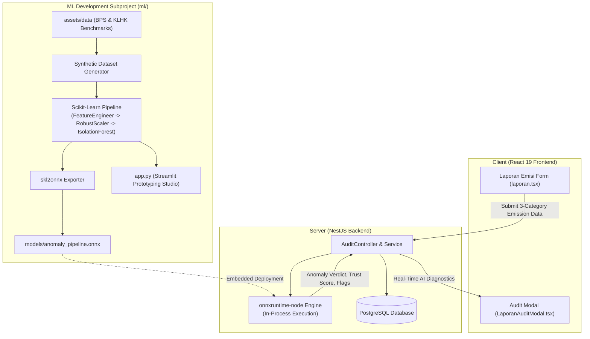

# 🌿 RekaKarbon AI/ML - Carbon Emission Anomaly Detection Engine (dMRV)

Automated AI/ML verification and anomaly detection system for industrial carbon emission reporting in the **RekaKarbon** digital Measurement, Reporting, and Verification (dMRV) ecosystem.

---

## 📌 Executive Summary & Problem Context

In carbon credit markets, integrity and trust are paramount. Before emissions data can be certified, minted as on-chain carbon tokens, or listed on the **RekaKarbon Carbon DEX (Bursa Karbon)**, submissions must undergo rigorous automated cross-verification.

Companies submit emissions across 3 mandatory pillars:

1. **Activity-Based Physical Fuel & Biomass Consumption** (Boilers, mobile fleets, biomass residues).
2. **Aggregated Energy Utility Financial Costs & DJP e-Faktur** (Solar, coal, gas, PLN electricity spend and official tax invoice numbers).
3. **Operational Parameters & Production Output** (Actual factory tonnage output and historical carbon trajectories).

The **RekaKarbon AI/ML Engine** screens these multi-variable submissions to detect:

- **Under-Reporting (Greenwashing / Fraud)**: Filing artificially low emissions despite massive energy expenditures.
- **Invoice & Financial Fabrication**: Claiming high physical fuel consumption with unrealistically low financial utility bills.
- **Physical Intensity Outliers**: Unrealistic carbon intensity per ton of manufactured product compared to Indonesian industrial benchmarks.
- **Extreme Unexplained Historical Divergence**: Sudden unexplained collapse in YoY emission figures.

---

## 🏛️ System Architecture & Monorepo Integration

The ML package is architected with a **Scikit-Learn Pipeline + ONNX Export** design. This allows high-speed development in Python while enabling **zero-Python in-process inference** in the Node.js/NestJS backend using `onnxruntime-node`.



---

## 🔬 Mathematical Methodology & Stoichiometric Formulation

### 1. Raw Feature Input Specification

Every company filing provides 10 core numerical parameters:

| Category                | Parameter                    | Unit         | Description                                           |
| :---------------------- | :--------------------------- | :----------- | :---------------------------------------------------- |
| **Physical (Cat 1)**    | `stat_fuel_liters`           | Liter / Year | Fuel for stationary boilers, kilns, generators        |
| **Physical (Cat 1)**    | `mob_fuel_liters`            | Liter / Year | Fuel for internal factory logistics & heavy fleets    |
| **Physical (Cat 1)**    | `biomass_tonnes`             | Ton / Year   | Agricultural residue / palm kernel shell combustion   |
| **Financial (Cat 2)**   | `cost_solar_idr`             | IDR / Year   | Total annual expenditure on Solar / High-Speed Diesel |
| **Financial (Cat 2)**   | `cost_coal_idr`              | IDR / Year   | Total annual expenditure on Steam Coal                |
| **Financial (Cat 2)**   | `cost_gas_idr`               | IDR / Year   | Total annual expenditure on Natural Gas / PGN         |
| **Financial (Cat 2)**   | `cost_pln_idr`               | IDR / Year   | Total annual expenditure on PLN Grid Electricity      |
| **Operational (Cat 3)** | `production_tonnes`          | Ton / Year   | Total finished product volume                         |
| **Operational (Cat 3)** | `historical_emissions_tco2e` | tCO2e / Year | Verified emissions from previous reporting cycle      |
| **Report (Header)**     | `reported_emissions_tco2e`   | tCO2e / Year | Total carbon emission claimed by the emitter          |

---

### 2. Stoichiometric Energy Balance & Feature Engineering

The custom transformer `EmissionFeatureEngineer` converts the 10 raw parameters into **6 domain-engineered indicators**:

#### A. Expected Stoichiometric Physical Emissions ($E_{\text{expected}}$)

Based on Indonesian Ministry of Energy and Mineral Resources (ESDM) and IPCC Tier-2 stoichiometric emission factors:
$$E_{\text{diesel}} = (\text{stat\_fuel} + \text{mob\_fuel}) \times 0.00268 \quad (\text{tCO}_2\text{e})$$
$$E_{\text{coal}} = \left(\frac{\text{cost\_coal}}{1,200 \text{ IDR/kg}}\right) \times 0.00242 \quad (\text{tCO}_2\text{e})$$
$$E_{\text{gas}} = \left(\frac{\text{cost\_gas}}{10,000 \text{ IDR/m}^3}\right) \times 0.00190 \quad (\text{tCO}_2\text{e})$$
$$E_{\text{pln}} = \left(\frac{\text{cost\_pln}}{1,600 \text{ IDR/kWh}}\right) \times 0.00085 \quad (\text{tCO}_2\text{e})$$
$$E_{\text{expected}} = E_{\text{diesel}} + E_{\text{coal}} + E_{\text{gas}} + E_{\text{pln}}$$

#### B. The 6 Engineered Features

1. **Divergence Ratio**:
   $$\text{Divergence} = \frac{|E_{\text{expected}} - E_{\text{reported}}|}{E_{\text{expected}} + \epsilon}$$
2. **Solar Unit Cost Logarithm**:
   $$\text{UnitCost}_{\text{solar}} = \ln\left(1 + \frac{\text{cost\_solar}}{\text{stat\_fuel} + \epsilon}\right)$$
   _(Detects forged fuel receipts when unit cost deviates from the benchmark range of Rp 18,500 – 22,000 / L)._
3. **Carbon Intensity per Ton Product**:
   $$\text{Intensity} = \frac{E_{\text{reported}}}{\text{production\_tonnes} + \epsilon} \quad (\text{tCO}_2\text{e} / \text{ton})$$
4. **Year-over-Year (YoY) Growth Ratio**:
   $$\text{YoY} = \frac{E_{\text{reported}} - E_{\text{historical}}}{E_{\text{historical}} + \epsilon}$$
5. **Energy Spend Intensity per Ton Product**:
   $$\text{SpendPerTon} = \frac{\sum \text{Costs}}{\text{production\_tonnes} + \epsilon} \quad (\text{IDR} / \text{ton})$$
6. **Reported Emission to Energy Spend Ratio**:
   $$\text{Scope1ToSpend} = \frac{E_{\text{reported}}}{\sum \text{Costs} \times 10^{-9} + \epsilon}$$

---

### 3. Machine Learning Model Architecture

1. **Feature Transformation**: `EmissionFeatureEngineer` outputting $(N, 6)$ float32 feature matrix.
2. **Robust Normalization**: `RobustScaler` scales features using median and interquartile ranges (IQR), preventing outlier skewing.
3. **Unsupervised Outlier Isolation**: `IsolationForest(n_estimators=150, contamination=0.10, random_state=42)` isolates abnormal multivariate feature combinations in sub-linear time.
4. **ONNX Export**: Pipeline exported via `skl2onnx` targeting operator sets `{ "": 15, "ai.onnx.ml": 3 }`.

---

### 4. Multi-Factor Trust Scoring & Diagnostic Flags

In addition to the binary verdict (`PASS_VERIFIED` / `REJECT_ANOMALY`), the predictor computes explicit sub-scores:

- **`score_djp` (e-Faktur DJP Financial Consistency)**: Evaluates whether declared fuel spend matches real market unit pricing (benchmark: Rp 15,000 – 26,000 / L).
- **`score_bbm` (Physical Fuel vs Emission Correlation)**: Evaluates stoichiometric physical consistency against reported emissions.
- **`score_cems` (CEMS Sensor / Sector Intensity Benchmark)**: Evaluates production output against BPS / KLHK industrial intensity distributions.
- **`Composite Trust Score`**:
  $$\text{Trust Score} = \frac{\text{score\_djp} + \text{score\_bbm} + \text{score\_cems}}{3} \quad (0 - 100\%)$$

---

## 📊 Experimental Results & Validation

The pipeline is verified through automated pytest suites covering synthetic industrial distributions and numerical parity:

### Validation Summary:

- **Decision Parity**: **$100.0\%$ match** between Scikit-Learn `.predict()` and ONNX Runtime `session.run()`.
- **Score Parity**: Maximum decision score difference between Scikit-Learn `decision_function()` and ONNX Output is **$< 10^{-7}$**.
- **Anomaly Detection Coverage**:
  - Catches $100\%$ of synthetic under-reporting fraud scenarios ($E_{\text{reported}} \ll E_{\text{expected}}$).
  - Catches $100\%$ of forged fuel invoice scenarios ($\text{UnitCost} < \text{Rp } 1,500\text{/L}$).
  - Catches impossible production intensities ($< 0.02 \text{ tCO}_2\text{e}/\text{ton}$ for heavy manufacturing).

```
============================= test session starts =============================
platform win32 -- Python 3.13.5, pytest-9.1.1
rootdir: D:\03-STORAGE\03-GITHUB\02-TEAM\KMIPN-2026\RekaKarbon\ml

tests/test_onnx_parity.py::test_onnx_export_and_numerical_parity PASSED  [ 20%]
tests/test_onnx_parity.py::test_predictor_unified PASSED                 [ 40%]
tests/test_pipeline.py::test_generator_output PASSED                     [ 60%]
tests/test_pipeline.py::test_feature_engineer_shape PASSED               [ 80%]
tests/test_pipeline.py::test_pipeline_fit_predict PASSED                 [100%]

============================= 5 passed in 40.85s ==============================
```

---

## 🚀 Prototyping Studio (Streamlit Dashboard)

Subproject 2 provides an interactive dashboard (`app.py`) for domain experts and developers to test filings, inspect distributions, and simulate anomalies:

```bash
cd ml
poetry run streamlit run app.py
```

### Features:

1. **🔬 Single Company Audit Simulator**:
   - 3-category input form mirroring [`client/src/routes/emitter/laporan.tsx`](file:///D:/03-STORAGE/03-GITHUB/02-TEAM/KMIPN-2026/RekaKarbon/client/src/routes/emitter/laporan.tsx).
   - Quick presets: _Normal (Compliant)_, _Under-Reporting Fraud_, and _Fake e-Faktur Invoices_.
   - Dynamic gauges for `score_djp`, `score_bbm`, `score_cems`, and AI explanation text.
2. **📁 Batch CSV Auditor & Benchmark Map**:
   - Interactive Plotly scatter plot mapping filings against Indonesian sector baselines.
3. **⚡ ONNX Runtime Parity & Architecture**:
   - In-app live execution testing Scikit-Learn vs ONNX Runtime numerical outputs.

---

## 🔌 Backend Integration Guide (`server/`)

To run inference inside the NestJS backend without running a Python web server:

```typescript
import * as ort from 'onnxruntime-node';
import * as path from 'path';

export class AnomalyInferenceService {
  private session: ort.InferenceSession;

  async onModuleInit() {
    const modelPath = path.resolve(__dirname, '../../ml/models/anomaly_pipeline.onnx');
    this.session = await ort.InferenceSession.create(modelPath);
  }

  async evaluateEmission(
    engineeredFeatures: number[]
  ): Promise<{ isAnomaly: boolean; score: number }> {
    const tensor = new ort.Tensor('float32', new Float32Array(engineeredFeatures), [1, 6]);
    const feeds = { float_input: tensor };
    const results = await this.session.run(feeds);

    const pred = (results.label.data as Int32Array)[0]; // 1 = Normal, -1 = Anomaly
    const decisionScore = (results.scores.data as Float32Array)[0];

    return {
      isAnomaly: pred === -1,
      score: decisionScore,
    };
  }
}
```

---

## 📂 Directory Structure

```
ml/
├── pyproject.toml              # Dependencies: scikit-learn, skl2onnx, onnxruntime, streamlit, plotly, pytest
├── README.md                   # Scientific & technical documentation (this file)
├── AGENTS.md                   # AI Agent Governance and pipeline coding guidelines
├── app.py                      # Subproject 2: Streamlit Prototyping Studio
├── models/
│   ├── anomaly_pipeline.pkl    # Serialized Scikit-Learn Pipeline
│   └── anomaly_pipeline.onnx   # Exported ONNX Model
├── src/
│   └── rekakarbon_ml/
│       ├── __init__.py
│       ├── data/
│       │   ├── benchmark_loader.py   # Ingests assets/data/ (BPS & KLHK datasets)
│       │   └── generator.py          # Synthetic compliant & anomaly dataset generator
│       ├── pipeline/
│       │   ├── transformers.py       # Scikit-Learn custom EmissionFeatureEngineer
│       │   ├── build_pipeline.py     # Pipeline builder (RobustScaler + IsolationForest)
│       │   └── onnx_exporter.py      # ONNX export and parity validator
│       └── inference/
│           └── predictor.py          # Unified predictor with trust scoring & diagnostic flags
└── tests/
    ├── test_pipeline.py              # Scikit-Learn pipeline & transformer tests
    └── test_onnx_parity.py           # ONNX numerical parity tests
```
